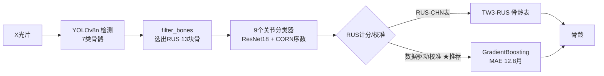

# Bone Age Assessment（骨龄评估系统）

基于「检测 → 骨过滤 → 分类 → RUS 计分 → 骨龄」两阶段方案（见 `../骨龄评估系统研发方案v2.md`）的骨龄评估系统。输入左手腕 X 光片，输出骨龄（岁/月）。

**正式适用范围：6-19 岁**（训练集无 0-5 岁样本，学龄前为外推区，不计入正式指标）。

## 架构总览



## 目录结构

```
Bone Age Assessment/
├── config.py                      # 全局路径与类别常量（所有脚本共用）
├── voc_to_yolo.py                 # 检测数据：VOC → YOLO 格式 + train/val 划分
├── prepare_classification.py      # 分类数据：arthrosis/ → ImageFolder 结构划分
├── preprocess.py                  # 预处理基线：灰度化 + 中值滤波 + CLAHE
├── data_audit.py                  # 数据质检（亮度/重复图/等级可分性）
├── train_detection.py             # YOLOv8 检测训练（两阶段迁移学习）
├── train_classification.py        # 9 个关节分类模型（ResNet18，类权重 CE）
├── train_ordinal.py               # CORN 序数回归（低 MAE）
├── evaluate_classification.py     # 分类评估（等级 MAE / ±1 级准确率）
├── filter_bones.py                # 从检测框选出 RUS 13 块骨
├── scoring.py                     # RUS-CHN 计分 + TW3-RUS 骨龄换算
├── pipeline.py                    # 端到端流水线（含 --calibrated / do_preprocess）
├── calibrate.py                   # 数据驱动校准：13骨得分回归骨龄
├── extend_calibration.py          # 全量 RSNA 训练集扩充校准（11278 张）
├── eval_full_val.py               # 全量验证集正式评估（默认 6 岁+）
├── eval_charts.py                 # 误差分析图表（分年龄/性别）
├── gradcam.py                     # Grad-CAM 热力图（可解释性）
├── gradio_app.py                  # Gradio 演示 Demo（端口 7860）
├── e2e_baseline.py                # 端到端 ResNet18 回归对比实验
├── validate_rsna.py               # RSNA 验证集评估脚本（RUS 表模式，参考）
├── models/
│   ├── classification/{关节}_best.pt        # 分类模型权重
│   ├── classification/{关节}_ordinal_best.pt # 序数回归权重
│   ├── bone_age_regressor.pkl       # 校准模型（GradientBoosting + imputer）
│   └── e2e/resnet18_boneage.pt      # 端到端回归模型
├── data/                           # RSNA 标签、特征缓存、预测结果 CSV
├── output/                         # 预览、图表、热力图、Demo 输出
└── datasets/                       # 处理后的数据集（脚本自动生成）
```

## 数据准备

```bash
# 检测数据（handbone/ VOC → datasets/detection/ YOLO）
python voc_to_yolo.py
python voc_to_yolo.py --dry-run    # 只看统计不落盘

# 分类数据（arthrosis/ → datasets/classification/）
python prepare_classification.py
python prepare_classification.py --dry-run
python prepare_classification.py --joints DIP Radius   # 只处理指定关节

# 预处理基线（灰度化 + 中值滤波 + CLAHE，生成 *_pre 数据集）
python preprocess.py                 # 全量处理检测 + 分类
python preprocess.py --detection     # 只处理检测
python preprocess.py --preview       # 只看前后对比图（output/preview/）

# 数据质检
python data_audit.py
```

## 数据说明

- **检测数据**：`handbone/` 共 881 张左手腕 X 光片，7 类（Radius / Ulna / MCPFirst / MCP / ProximalPhalanx / MiddlePhalanx / DistalPhalanx）
- **分类数据**：`arthrosis/` 9 个关节类型（DIP / DIPFirst / MCP / MCPFirst / MIP / PIP / PIPFirst / Radius / Ulna），每类按发育等级分文件夹
- 划分比例 train:val = 8:2，随机种子 42；每个等级至少 4 张进验证集
- **类别不平衡**（各关节 4x~20x）：用类权重 CE（`w_i = total/(n_class·count_i)`）+ 按等级分层划分处理

## 模型训练

```bash
# 检测模型：YOLOv8n 两阶段迁移学习（mAP50 = 0.991）
python train_detection.py
python train_detection.py --weights runs/bone7_ft/weights/best.pt   # 续训

# 分类模型：9 个 ResNet18（类权重 CE + 余弦退火 + 早停）
python train_classification.py --joints DIP Radius ...

# 序数回归：CORN（Ulna MAE 2.48 → 1.67，-33%；8 关节平均 0.49）
python train_ordinal.py --joints DIP DIPFirst MCP MCPFirst MIP PIP PIPFirst Radius
python train_ordinal.py --smoke     # 冒烟测试

# 评估
python evaluate_classification.py --joints DIP ...            # 普通分类
python evaluate_classification.py --ordinal --joints Ulna ... # 序数模型
```

## 推理流水线

```bash
# 单图骨龄（默认全 ordinal；★ 推荐校准模式）
python pipeline.py --image 图.png --calibrated --sex boy

# 用户上传原始 X 光片（自动 CLAHE 预处理，与训练一致）
python pipeline.py --image 原始片.png --calibrated --do-preprocess

# 其他选项
python pipeline.py --image 图.png --sex girl
python pipeline.py --image 图.png --use-ce       # 切回普通分类（对比实验）
python pipeline.py --demo --n 8                   # 验证集批量演示
python pipeline.py --image 图.png --save out.png  # 保存结果图
```

输出包含：13 骨检测结果、每块骨等级、RUS 总分、骨龄（岁/月）及方法标注。

## 验证与数据驱动校准

用 **RSNA 儿科骨龄挑战赛** 真实标签验证（881 张训练图 + 1425 张验证图全部来自该数据集）：

| 方法 | 测试 MAE | 相关 |
|------|---------|------|
| RUS-CHN 表硬查 | 53.5 月 | -0.32 ❌ |
| 数据驱动校准（881 训练） | 13.22 月 | 0.902 |
| **全量扩充校准（11278 训练，严格独立）** | **12.83 月（1.07 岁）** | **0.884** ✅ |

- **RUS 表硬查失败根因**：arthrosis 部分骨等级标注与真实成熟度脱节（桡骨相关仅 +0.15，却是最大权重 210/1000，成为噪声）
- **校准方案**：13 骨 RUS 得分特征 → GradientBoosting 回归骨龄；`extend_calibration.py` 用全量 RSNA 训练集（6 岁+ 11278 张）训练
- **正式评估**（`eval_full_val.py`，默认 6-19 岁）：严格独立 n=1273，男 12.72 / 女 13.77 月；误差 ≤12 月占 49%，≤18 月占 73%
- 实测：1526 真实 8.0 岁 → 8.13 岁（误差 1.5 月）；14732 → 6.05 岁（误差 3.0 月）

```bash
# 全量扩充校准（特征已缓存，重复运行很快）
python extend_calibration.py --skip-features --save-model   # 更新生产模型

# 正式评估（6岁+） + 误差图表
python eval_full_val.py --save
python eval_charts.py
```

## 可解释性（Grad-CAM）

```bash
python gradcam.py --image 图.png            # 13 骨热力图（整图叠加 + 网格对比）
python gradcam.py --image 图.png --joints Radius Ulna
python gradcam.py --demo
```

热力图高亮集中在骨骺/生长板区域，与放射科医生判读部位一致。输出 `output/gradcam/`。

## 演示 Demo（Gradio）

```bash
python gradio_app.py        # 浏览器打开 http://127.0.0.1:7860
```

上传原始 X 光片 → 自动预处理 → 输出带框标注图 + 13 骨等级得分明细 + 骨龄。

## 端到端回归对比实验

`e2e_baseline.py`：ResNet18 直接回归（X 光片 → 骨龄），与两阶段方案**相同训练/测试划分**：

| 指标 | 两阶段方案 | 端到端 ResNet18 |
|------|-----------|----------------|
| MAE | 12.83 月 | **10.57 月** |
| RMSE | 15.33 | **13.77** |
| 相关 | 0.884 | **0.911** |

**结论**：端到端精度更高（-18%），但两阶段提供 13 骨等级 + Grad-CAM 可解释性——符合「端到端精度高但可解释性弱」的行业判断。

## 最终成绩单（全部严格独立，6-19 岁）

| 模块 | 指标 |
|------|------|
| 检测 | mAP50 = 0.991 |
| 9 关节 ordinal | 等级 MAE = 0.62 |
| 两阶段骨龄 | MAE = 12.83 月（1.07 岁） |
| 端到端骨龄 | MAE = 10.57 月（0.88 岁） |
| 演示 | Gradio Demo + Grad-CAM + 误差图表 |

