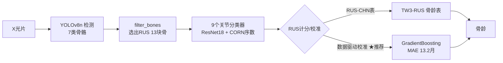

# Bone Age Assessment（骨龄评估系统）

基于「检测 → 骨过滤 → 分类 → RUS 计分 → 骨龄」两阶段方案（见 `../骨龄评估系统研发方案v2.md`）的骨龄评估系统。输入左手腕 X 光片，输出骨龄（岁/月）。

## 架构总览



## 目录结构

```
Bone Age Assessment/
├── config.py                      # 全局路径与类别常量（所有脚本共用）
├── voc_to_yolo.py                 # 检测数据：VOC → YOLO 格式 + train/val 划分
├── prepare_classification.py      # 分类数据：arthrosis/ → ImageFolder 结构划分
├── preprocess.py                  # 预处理基线：灰度化 + 中值滤波 + CLAHE
├── data_audit.py                  # 数据质检（亮度/重复图/等级可分性）
├── train_detection.py             # YOLOv8 检测训练（两阶段迁移学习）
├── train_classification.py        # 9 个关节分类模型（ResNet18，类权重 CE）
├── train_ordinal.py               # CORN 序数回归（低 MAE，用于 Ulna 等）
├── evaluate_classification.py     # 分类评估（等级 MAE / ±1 级准确率）
├── filter_bones.py                # 从检测框选出 RUS 13 块骨
├── scoring.py                     # RUS-CHN 计分 + TW3-RUS 骨龄换算
├── pipeline.py                    # 端到端流水线（含 --calibrated 校准模式）
├── calibrate.py                   # 数据驱动校准：13骨得分回归骨龄
├── validate_rsna.py               # RSNA 验证集评估脚本
├── models/
│   ├── classification/{关节}_best.pt     # 分类模型权重
│   ├── classification/{关节}_ordinal_best.pt  # 序数回归权重
│   └── bone_age_regressor.pkl      # 校准模型（GradientBoosting + imputer）
├── data/                           # RSNA 标签、特征缓存、预测结果 CSV
└── datasets/                       # 处理后的数据集（脚本自动生成）
    ├── detection_pre/              # 预处理版检测数据集（训练用）
    └── classification_pre/{关节}/  # 预处理版分类数据集
```

## 数据准备

```bash
# 检测数据（handbone/ VOC → datasets/detection/ YOLO）
python voc_to_yolo.py
python voc_to_yolo.py --dry-run    # 只看统计不落盘

# 分类数据（arthrosis/ → datasets/classification/）
python prepare_classification.py
python prepare_classification.py --dry-run
python prepare_classification.py --joints DIP Radius   # 只处理指定关节

# 预处理基线（灰度化 + 中值滤波 + CLAHE，生成 *_pre 数据集）
python preprocess.py                 # 全量处理检测 + 分类
python preprocess.py --detection     # 只处理检测
python preprocess.py --preview       # 只看前后对比图（output/preview/）

# 数据质检
python data_audit.py
```

## 数据说明

- **检测数据**：`handbone/` 共 881 张左手腕 X 光片，7 类（Radius / Ulna / MCPFirst / MCP / ProximalPhalanx / MiddlePhalanx / DistalPhalanx）
- **分类数据**：`arthrosis/` 9 个关节类型（DIP / DIPFirst / MCP / MCPFirst / MIP / PIP / PIPFirst / Radius / Ulna），每类按发育等级分文件夹
- 划分比例 train:val = 8:2，随机种子 42；每个等级至少 4 张进验证集
- **类别不平衡**（各关节 4x~20x）：用类权重 CE（`w_i = total/(n_class·count_i)`）+ 按等级分层划分处理

## 模型训练

```bash
# 检测模型：YOLOv8n 两阶段迁移学习（mAP50 = 0.991）
python train_detection.py
python train_detection.py --weights runs/bone7_ft/weights/best.pt   # 续训

# 分类模型：9 个 ResNet18（类权重 CE + 余弦退火 + 早停）
python train_classification.py --joints DIP Radius ...

# 序数回归：CORN（Ulna MAE 2.48 → 1.67，-33%）
python train_ordinal.py --joints DIP DIPFirst MCP MCPFirst MIP PIP PIPFirst Radius
python train_ordinal.py --smoke     # 冒烟测试

# 评估
python evaluate_classification.py --joints DIP ...            # 普通分类
python evaluate_classification.py --ordinal --joints Ulna ... # 序数模型
```

## 推理流水线

```bash
# 单图骨龄（默认：13骨 RUS 计分 + TW3 骨龄表）
python pipeline.py --image 图.png --sex boy

# ★ 推荐：数据驱动校准模式（GradientBoosting 回归骨龄）
python pipeline.py --image 图.png --calibrated --sex boy

# 其他选项
python pipeline.py --image 图.png --ordinal-all   # 全部关节用序数模型
python pipeline.py --demo --n 8                    # 验证集批量演示
python pipeline.py --image 图.png --save out.png   # 保存结果图
```

输出包含：13 骨检测结果、每块骨等级、RUS 总分、骨龄（岁/月）及方法标注。

## 验证与数据驱动校准

用 **RSNA 儿科骨龄挑战赛** 真实标签验证（881 张训练图 + 1425 张验证图全部来自该数据集）：

| 方法                           | 测试 MAE              | 相关系数        |
| ---------------------------- | ------------------- | ----------- |
| RUS-CHN 表硬查                  | 53.5 月              | -0.32 ❌     |
| **数据驱动校准（GradientBoosting）** | **13.22 月（1.10 岁）** | **0.902** ✅ |
| Ridge 回归（对照）                 | 22.24 月             | 0.672       |

- **RUS 表硬查失败根因**：arthrosis 部分骨等级标注与真实成熟度脱节（桡骨相关仅 +0.15，却是最大权重 210/1000，成为噪声）
- **校准方案**：`calibrate.py` 用 13 骨 RUS 得分作特征 → GradientBoosting 回归骨龄（2306 张标注图按年龄分层 85/15）
- 实测：14732 真实 5.8 岁 → 校准预测 6.11 岁（误差 3.7 月）；RUS 表预测 10.5 岁（误差 56 月）
- 分性别：男 13.0 月 / 女 13.5 月；P50 = 11.9 月，P90 = 24.6 月

```bash
# 重新校准（特征已缓存，重复运行很快）
python calibrate.py

# RSNA 验证集评估（RUS 表模式，仅作参考）
python validate_rsna.py
```

## 下一步

1. 等 8 关节 ordinal 训练完成 → 评估是否全量切换 `--ordinal-all`
2. RSNA 训练集图片下载完成后扩充校准数据，进一步降 MAE
3. 全量 1425 张验证集正式评估报告
