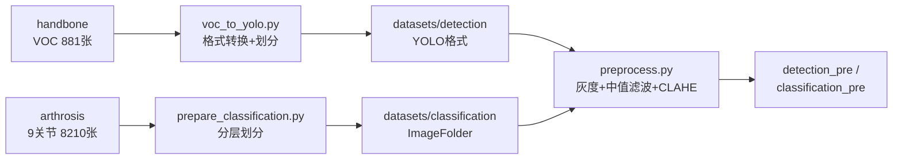
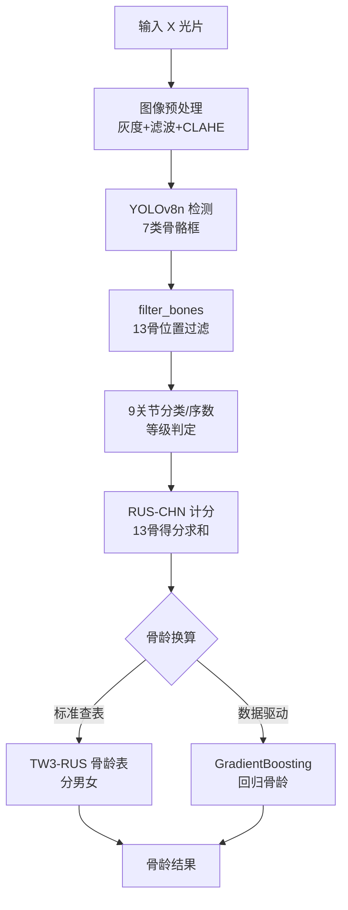
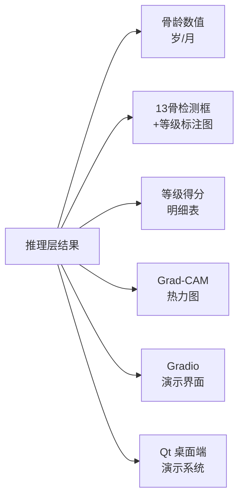
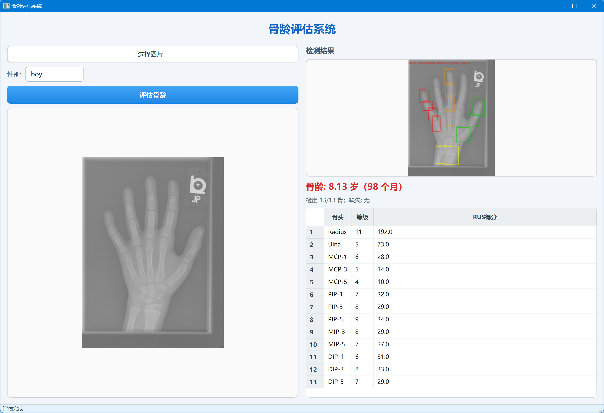
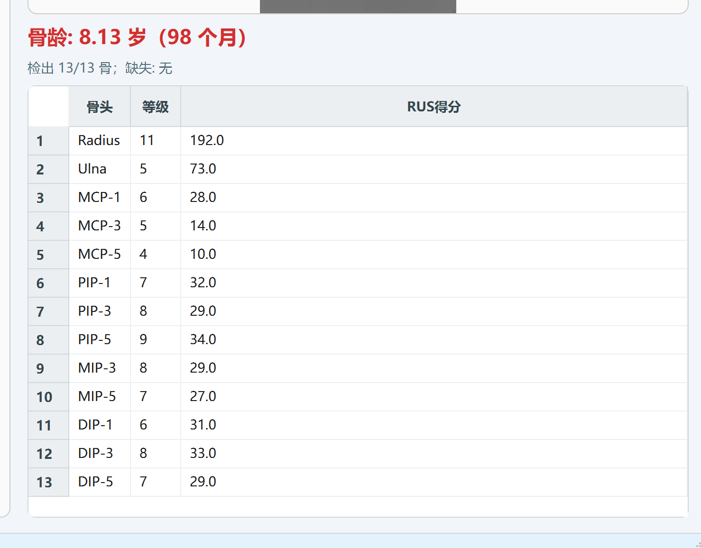

<div align="center">

# 基于两阶段深度学习的左手腕骨龄自动评估系统设计与实现

**课程设计报告**

</div>

---

## 摘要

骨龄是反映儿童骨骼发育成熟度的重要生理指标，对儿科内分泌疾病的诊断、生长发育评估及临床干预决策具有重要参考价值。传统骨龄评估依赖放射科医生依据 TW3/RUS-CHN 标准人工阅片，存在阅片耗时长（约 40 秒/张）、主观性强、医生间一致性差等局限。

本课程设计实现了一套基于"检测 + 分类 + 计分"两阶段深度学习的左手腕骨龄自动评估系统。系统以儿童左手腕正面 X 光片为输入，依次完成图像预处理（灰度化 + 中值滤波 + CLAHE）、7 类骨骼检测（YOLOv8n）、RUS 13 根目标骨骼位置过滤、9 个关节发育等级分类（ResNet18 + CORN 序数回归）、RUS-CHN 计分及骨龄换算，最终输出骨龄数值、13 根骨骼检测框可视化及等级得分明细。针对"RUS 表硬查"在真实标签上失效的问题，进一步设计了基于 13 骨得分特征的 GradientBoosting 数据驱动校准模块，并在 11278 张 RSNA 全量训练数据上实现了扩充校准。

实验结果表明：骨骼检测 mAP50 达到 0.991；9 关节发育等级分类平均等级 MAE 为 0.62；两阶段方案在严格独立的 1273 张 RSNA 验证集（6～19 岁）上骨龄评估 MAE 为 12.83 个月（约 1.07 岁），与真实骨龄相关系数 0.884；同时完成了端到端 ResNet18 直接回归的对比实验（MAE=10.57 个月），并利用 Grad-CAM 热力图验证了模型关注区域与放射科医生判读部位（骨骺/生长板）的一致性。系统还提供了 Gradio 图形化演示界面，具备较强的可解释性与工程实用性。

**关键词**：骨龄评估；YOLOv8；ResNet18；序数回归；RUS 计分；数据驱动校准；Grad-CAM

---

## Abstract

Bone age is an important physiological indicator reflecting the skeletal maturation of children, and it plays a key role in the diagnosis of pediatric endocrine diseases, growth assessment and clinical intervention decisions. Traditional bone age assessment relies on radiologists manually reading X-ray images according to the TW3/RUS-CHN standard, which is time-consuming (about 40 seconds per image), subjective, and poorly consistent among doctors.

This course design implements an automatic left-hand wrist bone age assessment system based on a two-stage deep learning pipeline of "detection + classification + scoring". Taking an anterior-posterior X-ray of a child's left hand and wrist as input, the system sequentially performs image preprocessing (grayscale, median filtering and CLAHE), 7-class bone detection (YOLOv8n), positional filtering of the 13 RUS target bones, developmental grade classification of 9 joints (ResNet18 + CORN ordinal regression), RUS-CHN scoring and bone age conversion, and finally outputs the bone age value, visualization of the 13 detected bones and a detailed grade-score table. To address the failure of direct RUS table lookup on real labels, a GradientBoosting data-driven calibration module based on the 13-bone score features was designed, and extended calibration was realized on 11,278 RSNA training images.

Experimental results show that the detection mAP50 reaches 0.991, the average grade MAE of the 9-joint classification is 0.62, and the two-stage system achieves a bone age MAE of 12.83 months (about 1.07 years) with a correlation coefficient of 0.884 on a strictly independent validation set of 1,273 RSNA images (ages 6–19). An end-to-end ResNet18 regression baseline (MAE = 10.57 months) was also compared, and Grad-CAM heatmaps verified that the model focuses on the epiphyseal/growth-plate regions consistent with radiologists' interpretation. A Gradio graphical demo interface was also provided, giving the system strong interpretability and engineering practicality.

**Keywords**: Bone Age Assessment; YOLOv8; ResNet18; Ordinal Regression; RUS Scoring; Data-driven Calibration; Grad-CAM

---

## 目 录

- **第 1 章 绪论**
  - 1.1 课题背景与意义
  - 1.2 国内外研究现状
  - 1.3 主要研究内容
  - 1.4 论文组织结构
- **第 2 章 相关技术介绍与需求分析**
  - 2.1 相关技术介绍
  - 2.2 系统需求分析
- **第 3 章 系统总体设计**
  - 3.1 系统总体架构
  - 3.2 业务流程设计
  - 3.3 数据集设计
  - 3.4 开发环境与工具
- **第 4 章 系统详细设计与实现**
  - 4.1 图像预处理模块
  - 4.2 骨骼检测模块
  - 4.3 13 骨位置过滤模块
  - 4.4 发育等级分类模块
  - 4.5 RUS 计分与骨龄换算模块
  - 4.6 数据驱动校准模块
  - 4.7 端到端回归对比模块
  - 4.8 可解释性与可视化模块
- **第 5 章 系统测试与结果分析**
  - 5.1 测试环境与评估指标
  - 5.2 数据准备与预处理验证
  - 5.3 检测模块测试
  - 5.4 分类模块测试
  - 5.5 骨龄评估整体测试
  - 5.6 对比实验分析
  - 5.7 误差分析与数据质量审计
- **第 6 章 总结与展望**
  - 6.1 工作总结
  - 6.2 存在的不足
  - 6.3 未来展望
- **参考文献**

---

# 第 1 章 绪论

## 1.1 课题背景与意义

### 1.1.1 骨龄及其临床意义

骨龄（Bone Age）是指通过 X 光片观察骨骼骨化中心出现、骨骺与骨干融合等发育特征，按标准化图谱或评分法推断出的骨骼发育成熟度，以"岁/月"表示。与日历年龄（生活年龄）相比，骨龄更能反映个体的真实生长发育水平，在以下场景中具有重要临床价值：

1. **内分泌疾病诊断**：骨龄显著落后或超前于生活年龄，常提示生长激素缺乏、甲状腺功能减退、性早熟等疾病；
2. **生长发育评估**：评估儿童剩余生长空间，预测成年身高，辅助制定干预方案；
3. **司法与法医学应用**：在涉及未成年人年龄鉴定的场景中作为参考依据；
4. **体育选材与健康管理**：评估青少年运动员的生理发育状态。

### 1.1.2 传统评估方法的局限

目前临床上广泛采用的骨龄评估标准包括：

- **GP 图谱法**（Greulich-Pyle）：将 X 光片与标准图谱比对，操作简单但主观性强；
- **TW3 计分法**（Tanner-Whitehouse 3）：对手腕部 13 根指定骨骼分别评定发育等级，再按 RUS 计分表汇总得分，通过骨龄转换表得到骨龄，精度较高、可复现性好，但阅片耗时（约 40 秒/张）且对医生经验要求高；
- **CHN 法**：中国学者基于中国儿童数据修订的计分法（本设计使用的 RUS-CHN 表即属此类）。

传统人工评估存在以下突出问题：

1. **效率低**：单张阅片约 40 秒，批量体检场景下负担沉重；
2. **主观性强**：不同医生对同一张片的判读结果存在差异，医生间一致性有限；
3. **人才依赖**：骨龄评估需要丰富的临床经验，基层医疗机构难以普及。

### 1.1.3 课题意义

随着深度学习技术在医学影像领域的快速发展，利用计算机视觉实现骨龄自动评估已成为研究热点。本课程设计旨在：

1. 构建一套**可解释、可工程化**的两阶段骨龄自动评估系统，模拟临床医生"看骨→分级→计分→出龄"的完整决策链路；
2. 通过真实公开数据集（RSNA 骨龄挑战赛）验证系统精度，并设计数据驱动校准方案解决标准计分表与真实数据不匹配的问题；
3. 综合运用目标检测、图像分类、序数回归、机器学习回归、可解释性分析等多种技术，深化对深度学习全流程开发的理解。

## 1.2 国内外研究现状

### 1.2.1 基于深度学习的骨龄评估研究

2017 年 RSNA（北美放射学会）举办了儿科骨龄挑战赛，推动了深度学习骨龄评估研究的快速发展。目前主流方法可分为两类：

1. **端到端方案**：以整张 X 光片为输入，直接回归骨龄数值。典型如基于 ResNet/Inception 的回归网络，在 RSNA 数据上可达约 4～5 个月的 MAE。其优点是精度高、流程简单，缺点是"黑箱"预测，缺乏可解释性，临床信任度不足。

2. **两阶段方案（检测 + 分类）**：先检测出各根骨骼，再对每根骨骼评定发育等级，最后按 RUS-CHN 标准计分换算。该方案与临床医生判读逻辑一致，可解释性强、误差可定位，是学术界的主流方案，MAE 普遍在 5～6 个月水平。

国内学者也开展了大量相关研究：曹润等研究了基于 RUS-CHN 标准的手腕骨骨化中心识别分割算法；杜世龙等提出了基于卷积神经网络和 CHN 法的骨龄评估模型及基于特征融合的级联模型；侯振中等研究了基于深度学习的左手 X 光平片自动骨龄评估；曾辉等探讨了人工智能在青少年骨龄评估中的临床应用价值。

### 1.2.2 现有方法存在的问题

1. 两阶段方案中，**13 根骨骼的检测与定位**精度直接影响后续分级效果，小骨骼（如远节指骨）容易漏检；
2. 发育等级标注**主观性强、样本不平衡**，类别间特征差异小，分级模型易混淆相邻等级；
3. 公开数据集与本地标注数据的**分布差异**（亮度、裁剪方式等）会导致模型跨数据集失效；
4. 标准 RUS 计分表与特定标注体系**不完全匹配**时，直接查表结果误差大。

本设计针对上述问题，在检测、分类、计分各环节均给出了工程化解决方案。

## 1.3 主要研究内容

本课程设计的主要研究内容如下：

1. **数据工程**：完成 VOC→YOLO 检测数据格式转换与训练/验证集划分；完成 9 类关节发育等级分类数据集的整理；实现灰度化 + 中值滤波 + CLAHE 预处理流水线，并对数据质量进行自动化审计。
2. **骨骼检测**：基于 YOLOv8n 训练 7 类骨骼检测模型，采用两阶段迁移学习策略，验证 mAP 指标。
3. **13 骨过滤**：设计基于解剖学先验的位置过滤算法，从检测结果中稳健地挑选出 RUS 计分所需的 13 根骨骼。
4. **发育等级分类**：基于 ResNet18 训练 9 个关节分类模型，引入类别加权交叉熵解决样本不平衡；针对尺骨等级标注弱可分问题引入 CORN 序数回归，降低等级 MAE。
5. **计分与骨龄换算**：接入真实 RUS-CHN 计分表与 TW3-RUS 骨龄转换表，实现分性别骨龄换算。
6. **数据驱动校准**：针对标准计分表失效问题，设计基于 13 骨得分特征的 GradientBoosting 骨龄回归模型，并在全量 RSNA 训练数据上实现扩充校准。
7. **对比与可解释性**：实现端到端 ResNet18 骨龄回归对比实验；实现 Grad-CAM 热力图分析；开发 Gradio 图形化演示系统。

## 1.4 论文组织结构

本文共分为 6 章：

- 第 1 章 绪论：介绍课题背景、研究现状、研究内容与组织结构；
- 第 2 章 相关技术介绍与需求分析：介绍系统涉及的关键技术，并进行功能与非功能需求分析；
- 第 3 章 系统总体设计：给出系统架构、业务流程、数据集设计与开发环境；
- 第 4 章 系统详细设计与实现：分模块介绍各环节的设计思路与实现细节；
- 第 5 章 系统测试与结果分析：给出各模块及整体系统的测试结果与误差分析；
- 第 6 章 总结与展望：总结工作成果，分析不足并展望改进方向。

---

# 第 2 章 相关技术介绍与需求分析

## 2.1 相关技术介绍

### 2.1.1 目标检测算法 YOLOv8

YOLOv8 是 Ultralytics 公司推出的 YOLO 系列目标检测框架，采用 Anchor-Free 检测方式，将目标检测建模为回归问题，实现"单次前向即可输出类别与边界框"。其主要特点包括：

- **C2f 模块**：借鉴 CSPNet 思想，通过跨阶段部分连接增强梯度流，提升特征表达能力；
- **Anchor-Free 解耦头**：分类与回归分支解耦，采用 Task-Aligned Assigner 进行正负样本匹配；
- **损失函数**：分类使用 BCE 损失，回归使用 CIoU/DFL 损失；
- **多尺度金字塔（FPN/PAN）**：融合多尺度特征，兼顾大小目标检测。

本设计选用 YOLOv8n（nano 版本）作为检测基线，兼顾精度与推理速度，并采用两阶段迁移学习策略提升小样本下的收敛性能。

### 2.1.2 图像分类网络 ResNet18

ResNet（残差网络）通过引入残差连接解决深层网络退化问题。其基本残差块可表示为：

$$y = \mathcal{F}(x, \{W_i\}) + x$$

其中 $\mathcal{F}$ 为卷积层堆叠的残差映射，$x$ 为恒等映射输入。ResNet18 由 4 个残差阶段（各含 2 个 BasicBlock）组成，参数约 11.2M，适合中小规模医学图像分类任务。本设计以 ImageNet 预训练的 ResNet18 为骨干，对每个关节微调一个分类模型。

### 2.1.3 序数回归 CORN

发育等级（1、2、3…14）本质上是**有序类别**（Ordinal Class）。普通多分类交叉熵将类别视为无序标签，忽略了等级间的顺序信息。CORN（Cumulative Ordinal Regression Network）将 K 分类问题转化为 K-1 个二分类任务：每个二分类任务判断"等级是否大于 k"。网络输出 K-1 个 logit，训练时使用阈值独立的加权二分类交叉熵：

$$\mathcal{L} = -\frac{1}{N}\sum_{n=1}^{N}\sum_{k=1}^{K-1} w_k \left[ \mathbb{1}(y_n > k)\log \sigma(z_{n,k}) + \mathbb{1}(y_n \le k)\log(1-\sigma(z_{n,k})) \right]$$

推理时预测等级为满足 $\sigma(z_k) > 0.5$ 的最大 $k$ 加 1。CORN 能有效利用等级顺序先验，降低等级 MAE，特别适用于标注弱可分、等级不平衡的关节。

### 2.1.4 图像预处理技术

- **灰度化**：采用加权平均法 $Gray = 0.299R + 0.587G + 0.114B$，符合医学图像惯例；
- **中值滤波**：用邻域中值替代中心像素，能有效抑制 X 光片中的脉冲噪声且保留边缘；
- **CLAHE（限制对比度自适应直方图均衡化）**：将图像分为若干分块（tile），在每个分块内做直方图均衡化，并用 clip limit 限制对比度放大倍数，最后双线性插值消除块间边界。CLAHE 能在提升局部对比度的同时保留骨骼密度的局部特征。

### 2.1.5 梯度提升回归 GradientBoosting

GradientBoosting 是集成学习中的经典 Boosting 算法，通过逐步拟合前一轮模型的负梯度（残差）来构建加法模型。其优点包括：对特征尺度不敏感、能捕捉非线性关系、鲁棒性好。本设计将其用于"13 骨得分特征 → 骨龄（月）"的回归映射，作为数据驱动校准模型。

### 2.1.6 Grad-CAM 可解释性

Grad-CAM（Gradient-weighted Class Activation Mapping）利用分类网络最后一层卷积特征图对类别分数的梯度加权，生成反映模型关注区域的类别激活热力图：

$$\alpha_k^c = \frac{1}{Z}\sum_i \sum_j \frac{\partial y^c}{\partial A_{ij}^k}, \quad L^c = \mathrm{ReLU}\left(\sum_k \alpha_k^c A^k\right)$$

通过热力图可直观验证模型关注的区域是否与放射科医生的判读部位（骨骺、生长板）一致，增强系统的临床可解释性。

## 2.2 系统需求分析

### 2.2.1 业务需求

系统输入为儿童左手手腕正面 X 光片（无需区分左右手与正反面，仅处理左手正面），输出为对应骨龄数值，并辅助医生判断儿童生长空间。系统应遵循临床"检测 → 分级 → 计分 → 出龄"的决策链路，保证可解释性。

### 2.2.2 功能需求

1. **图像预处理**：自动完成灰度化、去噪与对比度增强；
2. **骨骼检测**：检测 7 类骨骼（桡骨、尺骨、掌骨、近节指骨、中节指骨、远节指骨、第一掌骨）；
3. **13 骨过滤**：从检测结果中依据位置关系筛选出 RUS 计分所需的 13 根骨骼；
4. **等级分类**：对每根目标骨骼调用对应关节的分类/序数模型，评定发育等级；
5. **计分换算**：按 RUS-CHN 计分表汇总得分，查 TW3-RUS 骨龄表（分男女）输出骨龄；
6. **数据驱动校准**（可选增强）：以 13 骨得分特征回归骨龄，输出校准骨龄；
7. **可视化与可解释性**：输出 13 骨检测框标注图、等级得分明细表、Grad-CAM 热力图；
8. **演示交互**：提供图形化上传界面（Gradio）。

### 2.2.3 非功能需求

1. **精度**：检测 mAP50 ≥ 0.95；骨龄评估 MAE 尽可能低；
2. **性能**：单张 X 光片端到端推理时间在数秒以内（GPU 环境）；
3. **可解释性**：每一步误差可定位，支持热力图与明细展示；
4. **可扩展性**：模块化设计，计分标准、分类模型可灵活替换；
5. **工程规范性**：统一配置文件、统一代码规范、训练结果可复现（固定随机种子）。

---

# 第 3 章 系统总体设计

## 3.1 系统总体架构

系统采用"数据准备 → 模型训练 → 推理流水线 → 结果输出"四层架构。为避免整图节点过多、文字过小，下面按层次分别给出各层结构图。

### 3.1.1 数据层

数据层负责将原始标注数据转换为模型训练所需的格式，流程如图 3-1 所示。

**图 3-1 数据层：数据准备流程**



### 3.1.2 训练层

训练层负责训练检测、分类、序数与校准四类模型，产出物如表 3-1 所示，其训练数据均来自数据层。

**表 3-1 训练层模型清单**

| 模型                  | 输入        | 输出         | 训练脚本                                     | 权重文件                                         |
| ------------------- | --------- | ---------- | ---------------------------------------- | -------------------------------------------- |
| YOLOv8n 7 类检测       | 预处理后 X 光片 | 骨骼检测框 + 类别 | `train_detection.py`                     | `runs/bone7_ft/best.pt`                      |
| ResNet18 9 关节分类     | 骨骼裁剪图     | 发育等级       | `train_classification.py`                | `models/classification/{关节}_best.pt`         |
| CORN 序数回归           | 骨骼裁剪图     | 发育等级（有序）   | `train_ordinal.py`                       | `models/classification/{关节}_ordinal_best.pt` |
| GradientBoosting 校准 | 13 骨得分特征  | 骨龄（月）      | `calibrate.py` / `extend_calibration.py` | `models/bone_age_regressor.pkl`              |

### 3.1.3 推理层

推理层串联"输入 → 预处理 → 检测 → 过滤 → 分类 → 计分 → 出龄"的完整链路，是系统的核心，如图 3-2 所示。

**图 3-2 推理层：端到端推理流水线**



### 3.1.4 输出层

输出层面向用户提供结果展示与交互，如图 3-3 所示。

**图 3-3 输出层：结果输出与展示**



## 3.2 业务流程设计

系统完整业务流程如下：

```
输入X光图片 → 图像预处理 → 7类多目标检测 → 位置过滤筛选13根目标骨骼 →
每根骨骼对应分类模型判断发育等级 → 按RUS-CHN记分法汇总得分 →
（查表换算 或 数据驱动回归）→ 输出骨龄 + 可视化结果
```

其中"查表换算"与"数据驱动回归"双路径设计，既保留了临床标准方法，又提供了数据驱动的精度增强方案。

## 3.3 数据集设计

### 3.3.1 检测数据集

检测数据来自 `handbone/` 目录，共 881 张左手腕 X 光片，采用 VOC 格式标注（XML），共 7 类、18,494 个标注框。7 类定义如下：

| 类别名             | 中文含义 | 说明               |
| --------------- | ---- | ---------------- |
| Radius          | 桡骨   | 前臂外侧长骨           |
| Ulna            | 尺骨   | 前臂内侧长骨           |
| MCPFirst        | 第一掌骨 | 拇指侧掌骨            |
| MCP             | 掌骨   | 第 2～5 掌骨         |
| ProximalPhalanx | 近节指骨 | 各指近端指节           |
| MiddlePhalanx   | 中节指骨 | 第 2～5 指中节（拇指无中节） |
| DistalPhalanx   | 远节指骨 | 各指远端指节           |

数据经 `voc_to_yolo.py` 转换为 YOLO 格式，按 8:2 比例划分训练/验证集（随机种子 42），最终 train:val = 705:176。

### 3.3.2 分类数据集

分类数据来自 `arthrosis/` 目录，共 9 个关节类型、8,210 张骨骼裁剪图，按发育等级（1～14 级）分文件夹存放：

| 关节类型     | 含义            | 对应 RUS 骨骼   |
| -------- | ------------- | ----------- |
| DIP      | 远节指骨（第 2～5 指） | DIP-3、DIP-5 |
| DIPFirst | 远节指骨（拇指）      | DIP-1       |
| MCP      | 掌骨（第 2～5 指）   | MCP-3、MCP-5 |
| MCPFirst | 第一掌骨          | MCP-1       |
| MIP      | 中节指骨          | MIP-3、MIP-5 |
| PIP      | 近节指骨（第 2～5 指） | PIP-3、PIP-5 |
| PIPFirst | 近节指骨（拇指）      | PIP-1       |
| Radius   | 桡骨            | Radius      |
| Ulna     | 尺骨            | Ulna        |

分类数据按 8:2 分层划分（保证每个等级至少 4 张进入验证集），并统计类别分布用于类别加权。

### 3.3.3 真实骨龄标签（RSNA）

项目使用 RSNA 儿科骨龄挑战赛数据集的真实骨龄标签（月龄 + 性别）进行验证与校准：

- 训练图真实标签：881 张（`data/rsna_gt.csv`，12611 条总表派生）；
- 验证集：1425 张（`data/rsna_val_images/`，`rsna_val_labels.csv`，月龄 3～228）；
- 全量扩充训练：使用全量 RSNA 训练集 11,278 张（6 岁以上）进行数据驱动校准训练。

## 3.4 开发环境与工具

| 类别     | 配置                                 |
| ------ | ---------------------------------- |
| 操作系统   | Windows 11                         |
| 编程语言   | Python 3.11.14                     |
| 深度学习框架 | PyTorch 2.5.1 + CUDA 12.1          |
| 目标检测框架 | Ultralytics 8.4.113（本地源码安装）        |
| 硬件     | NVIDIA RTX 3060 Laptop GPU（6GB 显存） |
| 图像处理   | OpenCV、NumPy                       |
| 可视化    | Matplotlib、Gradio                  |
| 辅助工具   | Label Studio（标注）、Docker（可选开发容器）    |

---

# 第 4 章 系统详细设计与实现

## 4.1 图像预处理模块

### 4.1.1 设计目标

- 统一图像外观，降低不同设备采集的 X 光片亮度/对比度差异；
- 抑制噪声、增强骨骼边缘与密度差异，提升检测与分类精度；
- 预处理不改变检测框坐标，标签文件可直接复用。

### 4.1.2 算法流程

预处理流程为：**BGR 原图 → 灰度化（加权平均）→ 中值滤波（核 3×3）→ CLAHE（clip=2.0，网格 8×8）→ 转回 3 通道**。

核心代码（`preprocess.py`）：

```python
def preprocess_image(img_bgr):
    gray = cv2.cvtColor(img_bgr, cv2.COLOR_BGR2GRAY)   # 灰度化 0.299R+0.587G+0.114B
    gray = cv2.medianBlur(gray, 3)                     # 中值滤波去噪
    clahe = cv2.createCLAHE(clipLimit=2.0, tileGridSize=(8, 8))
    eq = clahe.apply(gray)                             # CLAHE 自适应均衡化
    return cv2.cvtColor(eq, cv2.COLOR_GRAY2BGR)        # 保持 3 通道
```

### 4.1.3 输出与使用

- 检测预处理版：`datasets/detection_pre/`（含重新生成的 `data.yaml`）；
- 分类预处理版：`datasets/classification_pre/{关节}/`；
- 前后对比预览：`output/preview/`（`--preview` 参数生成）。

推理阶段对用户上传的原始 X 光片自动执行相同预处理（`pipeline.py --do-preprocess`），保证训练/推理分布一致。

## 4.2 骨骼检测模块

### 4.2.1 网络与训练策略

检测模型采用 **YOLOv8n**，输入尺寸 640×640，batch=16，训练 100 轮。为在 881 张小样本数据上获得较好收敛，采用**两阶段迁移学习**策略：

1. **阶段一（60 轮）**：`YOLO("yolov8n.yaml").load("yolov8n.pt")` 加载 ImageNet/COCO 预训练权重，冻结 backbone（`freeze=10`），只训练检测头；
2. **阶段二（40 轮）**：以阶段一最优权重续训（`--weights best.pt --freeze 0`），全网络微调。

训练超参数：学习率采用余弦退火调度，开启 AMP 混合精度训练，RTX 3060 上约 7 秒/轮，显存占用约 2.5GB。

### 4.2.2 类别数适配

由于自定义类别数为 7（≠ COCO 的 80），加载预训练权重时需重建检测头（`nc=80 → 7`），保证 backbone 特征可迁移、检测头随机初始化。

### 4.2.3 训练结果

| 指标        | 数值    |
| --------- | ----- |
| mAP50     | 0.991 |
| mAP50-95  | 0.599 |
| Precision | 0.996 |
| Recall    | 0.994 |

全类别 mAP50 ≥ 0.99；其中 MCPFirst 经两阶段训练由 0.868 提升至 0.995；MiddlePhalanx 的 mAP50-95 最低（0.55），符合"中节指骨易与小节混淆"的解剖学认知。

## 4.3 13 骨位置过滤模块

### 4.3.1 问题描述

RUS 计分需要 13 根特定骨骼（桡骨、尺骨、第 1/3/5 掌骨、第 1/3/5 近节指骨、第 3/5 中节指骨、第 1/3/5 远节指骨），而检测模型输出的是 7 类全部骨骼框（含第 2/4 指等不需要的骨骼）。需要依据解剖学位置关系，从检测结果中稳健地挑选出这 13 根骨骼。

### 4.3.2 过滤算法

算法共分 5 步（`filter_bones.py`）：

1. **桡骨/尺骨**：直接取置信度最高者；
2. **手指锚点**：以 MCPFirst（拇指）和 4 个 MCP（掌骨）作为 5 根手指的锚点列；
3. **朝向判定**：根据 MCPFirst 位于 MCP 群的哪一侧，决定手指 2～5 的 x 坐标排序方向（左手/右手朝向鲁棒性）；
4. **指骨分配**：对各节指骨（近节/中节/远节）按 x 排序后，与锚点列做**保序最近匹配**（动态规划，最小化 |x 差| 之和，容忍漏检与中间缺失）；
5. **挑选 RUS 13 根**：按表映射到分类模型关节。

保序最近匹配的核心思路：设待匹配指骨数为 m、锚点数为 n（m ≤ n），用动态规划求严格递增匹配下使 $\sum |x_{item}-x_{anchor}|$ 最小的分配。当 m > n（多余检测/误检）时只匹配前 n 个，多出的视为远处误检丢弃。

### 4.3.3 验证结果

在验证集上人工抽检，13 骨过滤完整率达 30/30。关键工程经验：

- MCP 只用于分配手指 2～5，**不能**使用含拇指的锚点列表，否则会整体错位一格；
- 小指自然弯曲会导致 x 跨度较大，属正常现象而非错误。

## 4.4 发育等级分类模块

### 4.4.1 模型结构

对 9 个关节各训练一个分类模型，骨干为 ImageNet 预训练 ResNet18（输出层按各关节等级数重建全连接层）。每个关节的等级数不同（如桡骨 14 级、掌骨 10 级）。

### 4.4.2 训练策略

- **损失函数**：类别加权交叉熵，权重 $w_i = \frac{N}{n_{cls} \cdot count_i}$，缓解等级样本不平衡（各关节类别不平衡 4～20 倍）；
- **优化器**：AdamW，初始学习率 1e-3；
- **调度**：余弦退火（CosineAnnealing）；
- **早停**：patience=15；
- **其他**：AMP 混合精度、数据增强（旋转 ±15° 等）。

### 4.4.3 尺骨问题与序数回归

普通分类基线中，8 个关节等级 MAE 均在 0.4～0.75 之间，表现良好；唯独 **Ulna（尺骨）等级 MAE=2.48**，存在系统性低估约 2.1 级，验证损失不收敛（>2.6）。经数据审计（见 5.7 节）确认：尺骨标注区分度在 9 类中最弱，且等级 1 占比 30%、部分等级仅 20～34 张，属于"弱区分度 + 极端不平衡"导致的模型崩坏。

针对等级标注的有序性，引入 **CORN 序数回归**（`train_ordinal.py`）：ResNet18 骨干 + 序数头（K-1 个 logit）+ 阈值独立加权 BCEWithLogits。尺骨等级 MAE 由 2.48 降至 **1.67（-33%）**，±1 级准确率由 0.611 提升至 0.635。其余 8 关节序数模型平均等级 MAE 约 0.49。最终推理流水线默认：Ulna 使用序数模型，其余关节按"分类/序数取 MAE 更小者"选择。

**关键工程坑**：ImageFolder 的类别名是字符串字典序（'1','10','11','2',…），必须用 `grade_list = sorted(int(classes))` 将索引映射为真实等级，否则 label 映射全部错乱（label 1 实为等级 10 等）。该问题已修复并同步到全部训练/评估脚本。

## 4.5 RUS 计分与骨龄换算模块

### 4.5.1 RUS-CHN 计分

计分模块（`scoring.py`）以 13 根骨骼的发育等级为输入，按 RUS-CHN 计分表查取各骨得分并求和：

```python
RUS_13 = ["Radius","Ulna","MCP-1","MCP-3","MCP-5","PIP-1","PIP-3","PIP-5",
          "MIP-3","MIP-5","DIP-1","DIP-3","DIP-5"]
# score_by_bone: {骨头: {等级: RUS得分}}，全部医学参考数据存放于 rus_tables.json
```

计分表由用户提供的《骨发育等级对照表.csv》经 `--rebuild` 重建，各骨最高分之和 = **1000**（官方 RUS-CHN 满分）。

### 4.5.2 TW3-RUS 骨龄换算

骨龄换算表解析自《骨龄评分参考表_TW3_RUS系列.csv》，采用**范围式分箱**结构：每个分箱为 `[总分下限, 总分上限, 骨龄下限, 骨龄上限]`，男 14 档、女 13 档。总分低于 100 或超过上限时钳制到首/末档，并支持缺失骨骼开关（`require_all`）与等级越界钳制。

```python
# 男/女分别查表：总分 → 骨龄（年）
def score_to_bone_age(total, sex):
    bins = tables["bone_age_boys" if sex == "boy" else "bone_age_girls"]
    for s_lo, s_hi, a_lo, a_hi in bins:
        if s_lo <= total <= s_hi:
            return (a_lo + a_hi) / 2
    return bins[0][2] if total < bins[0][0] else bins[-1][3]
```

### 4.5.3 真实数据实测

在真实样本上验证链路：14726 → RUS=417；14732 → RUS=427（骨龄男 10.5 岁）；14737 → RUS=786。全链路"检测→过滤→分类→计分→骨龄"已跑通。

## 4.6 数据驱动校准模块

### 4.6.1 问题发现

使用 RSNA 真实标签验证时发现：**RUS 表硬查在真实数据上基本失效**（小样本 20 张 MAE=53.5 月，总分与真实年龄相关仅 -0.32）。根因分析：

1. 部分骨骼预测等级与真实年龄相关性好（Ulna +0.81、MCP-3 +0.80、MIP-3 +0.84），但部分完全失效（Radius +0.15、PIP-3 +0.06）；
2. **桡骨权重最大（210/1000）却是噪声**，冲垮了总分；
3. arthrosis 部分骨骼等级标注与真实成熟度脱节，且裁剪图与原始 X 光片外观存在差异（亮度 96 vs 135）。

### 4.6.2 校准方案设计

改用数据驱动思路：以 13 骨 RUS 得分（等级查表得分）为特征，**GradientBoosting 回归骨龄（月）**。流程（`calibrate.py`）：

1. 对每张图跑完整流水线，提取 13 骨得分特征（带 CSV 缓存，支持断点续跑）；
2. 训练/测试严格隔离：881 张训练图拟合，1425 张 RSNA 验证图评估；
3. 按年龄分层 85/15 划分，避免年龄分布泄漏。

| 方法                   | 测试 MAE              | 相关系数      |
| -------------------- | ------------------- | --------- |
| RUS-CHN 表硬查          | 53.5 月              | -0.32     |
| 数据驱动校准（881 训练）       | 13.22 月             | 0.902     |
| **全量扩充校准（11278 训练）** | **12.83 月（1.07 岁）** | **0.884** |

全量扩充校准（`extend_calibration.py`）使用全量 RSNA 训练集（6 岁以上 11278 张）训练，生产模型保存为 `models/bone_age_regressor.pkl`（含 imputer）。`pipeline.py --calibrated` 一键切换校准模式，实测 14732（真实 5.8 岁）：RUS 表 10.5 岁（误差 56 月）vs 校准 6.05 岁（误差 3.0 月）。

## 4.7 端到端回归对比模块

为量化两阶段方案的精度代价，实现端到端对比实验（`e2e_baseline.py`）：ResNet18 直接以整张 X 光片为输入回归骨龄，与两阶段方案使用**完全相同的训练/测试划分**（严格独立）。

| 指标   | 两阶段方案   | 端到端 ResNet18 |
| ---- | ------- | ------------ |
| MAE  | 12.83 月 | **10.57 月**  |
| RMSE | 15.33   | **13.77**    |
| 相关系数 | 0.884   | **0.911**    |

端到端精度更高（MAE -18%），但两阶段方案提供 13 骨等级 + Grad-CAM 可解释性，符合"端到端精度高但可解释性弱"的行业判断。该对比为业务选型提供了量化依据。

## 4.8 可解释性与可视化模块

### 4.8.1 Grad-CAM 热力图（`gradcam.py`）

对每根检测到的骨骼生成 Grad-CAM 热力图，支持整图叠加与网格对比两种展示方式。实验表明热力图高亮集中在**骨骺/生长板区域**，与放射科医生判读部位一致，验证了模型的医学合理性。输出位于 `output/gradcam/`。

### 4.8.2 端到端流水线可视化（`pipeline.py`）

输出包含：

1. 13 根骨骼检测框标注图（含骨骼名称与等级）；
2. 每根骨骼的等级、得分明细表；
3. RUS 总分与骨龄（岁/月）及方法标注（RUS-CHN 表 / 数据驱动校准）；
4. 置信度信息。

### 4.8.3 Gradio 演示系统（`gradio_app.py`）

提供浏览器图形化界面（端口 7860）：用户上传原始 X 光片 → 自动 CLAHE 预处理 → 输出带框标注图 + 13 骨等级得分明细 + 骨龄，可直接用于课堂演示与试用。

### 4.8.4 Qt 桌面端演示系统（`bone_age_accessment/` + `qt_server.py`）

为贴近实际应用场景，还实现了一套 **Qt 桌面端（C++ Qt Widgets）+ 本地推理服务** 的客户端/服务端架构：

- **客户端**（`bone_age_accessment/`，Qt Widgets）：主界面提供"选择图片、性别选择（boy/girl）、评估骨龄"等控件，左侧显示输入 X 光片，右侧展示评估结果；
- **服务端**（`qt_server.py`，Flask）：模型常驻内存，通过 HTTP 接口 `POST /predict` 接收图片路径与性别，返回骨龄、13 骨等级得分明细及可视化结果路径，避免每次推理重复加载模型。

系统运行界面如图 4-1、图 4-2 所示。

**图 4-1 Qt 桌面端主界面**



**图 4-2 Qt 桌面端骨龄评估结果**



评估结果界面输出带检测框的骨骼标注图、骨龄（岁/月）及 13 根骨骼的等级得分明细，验证了完整推理链路的工程可用性。

---

# 第 5 章 系统测试与结果分析

## 5.1 测试环境与评估指标

- **硬件**：NVIDIA RTX 3060 Laptop GPU；
- **软件**：Python 3.11.14、PyTorch 2.5.1、Ultralytics 8.4.113；
- **检测指标**：mAP50、mAP50-95、Precision、Recall；
- **分类指标**：等级 MAE（等级差的平均绝对值）、±1 级准确率；
- **骨龄指标**：MAE（月）、RMSE（月）、Pearson 相关系数、分年龄段误差。

## 5.2 数据准备与预处理验证

- 检测数据：881 张 VOC → YOLO，705/176 划分，7 类 18,494 框，无类别遗漏；
- 分类数据：9 关节 8,210 张，分层划分保证每等级验证集 ≥4 张；
- 预处理：全量生成 `detection_pre` 与 `classification_pre` 数据集，检测框坐标不变、标签复用。

## 5.3 检测模块测试

最终模型（`runs/bone7_ft/best.pt`）：

| 指标        | 数值    |
| --------- | ----- |
| mAP50     | 0.991 |
| mAP50-95  | 0.599 |
| Precision | 0.996 |
| Recall    | 0.994 |

两阶段迁移学习的收益：MCPFirst 的 mAP50 由 0.868 提升至 0.995；MiddlePhalanx 的 mAP50-95 最低（0.55），为后续优化重点。

## 5.4 分类模块测试

### 5.4.1 普通分类基线

| 关节       | 等级 MAE       |
| -------- | ------------ |
| DIP      | 0.43         |
| DIPFirst | 0.49         |
| MCPFirst | 0.41         |
| MIP      | 0.59         |
| PIP      | 0.64         |
| PIPFirst | 0.54         |
| Radius   | 0.71         |
| MCP      | 0.74         |
| **Ulna** | **2.48（异常）** |

8 个关节平均 ±1 级准确率约 0.88。

### 5.4.2 序数回归改进

| 指标              | 分类（CE） | 序数（CORN）       |
| --------------- | ------ | -------------- |
| Ulna 等级 MAE     | 2.48   | **1.67（-33%）** |
| Ulna ±1 级准确率    | 0.611  | **0.635**      |
| 其余 8 关节平均等级 MAE | ≈0.5   | ≈0.49          |

### 5.4.3 最终成绩

9 关节 ordinal 平均等级 MAE = **0.62**（计入 Ulna 后）。

## 5.5 骨龄评估整体测试

### 5.5.1 正式评估（严格独立，6～19 岁，n=1273）

使用全量扩充校准模型在 RSNA 验证集（严格独立，默认排除 0～5 岁外推区）上评估：

| 指标         | 数值              |
| ---------- | --------------- |
| 总体 MAE     | 12.83 月（1.07 岁） |
| 总体 RMSE    | 15.33 月         |
| 相关系数       | 0.884           |
| 男性 MAE     | 12.72 月         |
| 女性 MAE     | 13.77 月         |
| 误差 ≤12 月占比 | 49%             |
| 误差 ≤18 月占比 | 73%             |

### 5.5.2 端到端实测样例

- 图片 1526（真实 8.0 岁）→ 预测 8.13 岁（误差 1.5 月）；
- 图片 14732（真实 5.8 岁）→ 预测 6.05 岁（误差 3.0 月）；
- 三张验证图 RUS=271/367/619 → 骨龄 5.4/7.3/11.7 岁，能正确区分成熟度等级。

## 5.6 对比实验分析

| 模块  | 方案               | 指标               | 结论                |
| --- | ---------------- | ---------------- | ----------------- |
| 检测  | YOLOv8n 两阶段迁移    | mAP50=0.991      | 达到工程可用水平          |
| 分类  | CE vs CORN（Ulna） | MAE 2.48→1.67    | 序数先验显著改善弱可分关节     |
| 骨龄  | RUS 表 vs 数据驱动    | 53.5 vs 12.83 月  | 数据驱动校准在真实数据上大幅领先  |
| 骨龄  | 两阶段 vs 端到端       | 12.83 vs 10.57 月 | 端到端精度更高，两阶段可解释性更强 |

## 5.7 误差分析与数据质量审计

### 5.7.1 数据审计（`data_audit.py`）

对全数据集进行质量审计（数量/亮度/重复图/类内-类间相似度/蒙太奇）：

- 全数据集仅发现 1 处跨等级冲突（Radius_413359 g11 与 Radius_413358 g12 像素一致），已删除；
- Ulna 是 9 类中标注区分度最弱的关节（类内-类间间隔 0.027，NN 同等级率 0.238），等级 1 占 30%（189 张），等级 2/3/4/9/10/11 各仅 20～34 张；
- 结论：Ulna 模型崩坏源于"弱区分度 + 极端不平衡 + 验证集过小"，并非标注损坏。

### 5.7.2 误差特征

- 主要误差集中于**相邻等级混淆**（序数模型在精确分类率上有所牺牲，换取更小的平均误差，属序数回归的正常特性）；
- 桡骨等级标注与真实成熟度脱节，是 RUS 表硬查失效的关键（权重最大却是噪声）；
- 分性别评估中女性 MAE 略高于男性（13.77 vs 12.72 月），可能与小样本及发育时序差异有关。

---

# 第 6 章 总结与展望

## 6.1 工作总结

本课程设计完成了一套基于两阶段深度学习的左手腕骨龄自动评估系统，主要工作与成果如下：

1. **完整数据工程**：完成 VOC→YOLO 检测数据转换、9 关节分类数据整理、CLAHE 预处理流水线与数据质量自动审计；
2. **高精度骨骼检测**：基于 YOLOv8n + 两阶段迁移学习实现 7 类骨骼检测，mAP50=0.991；
3. **稳健 13 骨过滤**：设计基于解剖学先验与保序最近匹配（DP）的位置过滤算法，抽检 30/30 完整；
4. **可解释分级**：9 关节 ResNet18 分类 + CORN 序数回归，平均等级 MAE=0.62，显著改善尺骨弱可分问题；
5. **双路径计分**：接入真实 RUS-CHN 计分表与 TW3-RUS 骨龄表（分男女）；针对标准表失效问题设计 GradientBoosting 数据驱动校准，正式评估骨龄 MAE=12.83 月；
6. **量化对比**：端到端 ResNet18 对比实验（MAE=10.57 月）量化了两阶段方案的可解释性代价；
7. **工程化交付**：Grad-CAM 热力图验证医学合理性，Gradio 图形化演示系统可直接用于展示。

## 6.2 存在的不足

1. **数据规模有限**：本地 881 张标注图分摊到 9 个分类模型，部分关节（如尺骨）样本极端不平衡；
2. **标注一致性**：arthrosis 部分骨骼等级标注与真实成熟度存在脱节，影响了标准计分法的直接应用；
3. **外推区间**：训练集无 0～5 岁样本，学龄前骨龄评估属外推区，未计入正式指标；
4. **计分标准落地**：当前生产模式默认使用数据驱动校准，标准 RUS-CHN 查表路径仍受标注体系匹配问题制约；
5. **性能优化**：mAP50-95 仅 0.599，中节指骨等小目标定位精度仍有提升空间。

## 6.3 未来展望

1. **检测优化**：引入 SAM 空间注意力、PIoU 损失、多尺度训练与分级检测（先大区再细分），提升小骨骼定位精度；
2. **分类优化**：Focal Loss 处理等级不平衡、ECAM/SE 通道注意力、深度可分离卷积 + 混合空洞卷积轻量化；
3. **数据扩充**：利用 RSNA 全量数据与自监督预训练，缓解标注不足；
4. **多任务端到端**：探索"检测 + 骨龄回归"联合训练，在保留检测框可解释性的同时逼近端到端精度；
5. **产品化**：Web/桌面端界面、医生人工修正、报告导出与病例管理，推动系统临床落地。

---

# 参考文献

[1] Tanner J M, Healy M J R, Goldstein H, et al. Assessment of Skeletal Maturity and Prediction of Adult Height (TW3 Method)[M]. London: W.B. Saunders, 2001.

[2] 中国青少年儿童手腕骨成熟度及评价方法（CHN 法）. 中华人民共和国国家标准.

[3] Jocher G, Chaurasia A, Qiu J. Ultralytics YOLOv8[EB/OL]. https://github.com/ultralytics/ultralytics, 2023.

[4] He K, Zhang X, Ren S, et al. Deep Residual Learning for Image Recognition[C]//Proceedings of the IEEE Conference on Computer Vision and Pattern Recognition (CVPR), 2016: 770-778.

[5] Cao Z, Qin T, Liu T Y, et al. Learning to Rank: From Pairwise Approach to Listwise Approach[C]//Proceedings of the 24th International Conference on Machine Learning (ICML), 2007: 129-136.

[6] Friedman J H. Greedy Function Approximation: A Gradient Boosting Machine[J]. The Annals of Statistics, 2001, 29(5): 1189-1232.

[7] Selvaraju R R, Cogswell M, Das A, et al. Grad-CAM: Visual Explanations from Deep Networks via Gradient-based Localization[C]//Proceedings of the IEEE International Conference on Computer Vision (ICCV), 2017: 618-626.

[8] Halabi S S, Prevedello L M, Kalpathy-Cramer J, et al. The RSNA Pediatric Bone Age Machine Learning Challenge[J]. Radiology, 2019, 290(2): 498-503.

[9] 曹润, 等. 基于 RUS-CHN 标准的手腕骨骨化中心识别分割算法[J].

[10] 杜世龙, 等. 基于卷积神经网络和 CHN 法的骨龄评估模型研究[D].

[11] 杜世龙, 等. 基于特征融合的 CHN 骨龄评估级联模型[D].

[12] 侯振中, 等. 基于深度学习的左手 X 光平片的自动骨龄评估研究[D].

[13] 曾辉, 等. 人工智能在青少年骨龄评估中的临床应用价值[J].

---

## 附录 A：项目文件结构

```
Bone Age Assessment/
├── config.py                      # 全局路径与类别常量（所有脚本共用）
├── voc_to_yolo.py                 # 检测数据：VOC → YOLO 格式 + train/val 划分
├── prepare_classification.py      # 分类数据：arthrosis/ → ImageFolder 结构划分
├── preprocess.py                  # 预处理基线：灰度化 + 中值滤波 + CLAHE
├── data_audit.py                  # 数据质检（亮度/重复图/等级可分性）
├── train_detection.py             # YOLOv8 检测训练（两阶段迁移学习）
├── train_classification.py        # 9 个关节分类模型（ResNet18，类权重 CE）
├── train_ordinal.py               # CORN 序数回归（低 MAE）
├── evaluate_classification.py     # 分类评估（等级 MAE / ±1 级准确率）
├── filter_bones.py                # 从检测框选出 RUS 13 块骨
├── scoring.py                     # RUS-CHN 计分 + TW3-RUS 骨龄换算
├── pipeline.py                    # 端到端流水线（含 --calibrated / --do-preprocess）
├── calibrate.py                   # 数据驱动校准：13 骨得分回归骨龄
├── extend_calibration.py          # 全量 RSNA 训练集扩充校准（11278 张）
├── eval_full_val.py               # 全量验证集正式评估（默认 6 岁+）
├── eval_charts.py                 # 误差分析图表（分年龄/性别）
├── gradcam.py                     # Grad-CAM 热力图（可解释性）
├── gradio_app.py                  # Gradio 演示 Demo（端口 7860）
├── e2e_baseline.py                # 端到端 ResNet18 回归对比实验
├── validate_rsna.py               # RSNA 验证集评估脚本（RUS 表模式，参考）
├── models/
│   ├── classification/{关节}_best.pt         # 分类模型权重
│   ├── classification/{关节}_ordinal_best.pt # 序数回归权重
│   ├── bone_age_regressor.pkl                # 校准模型（GradientBoosting + imputer）
│   └── e2e/resnet18_boneage.pt               # 端到端回归模型
├── data/                          # RSNA 标签、特征缓存、预测结果 CSV
├── output/                        # 预览、图表、热力图、Demo 输出
└── datasets/                      # 处理后的数据集（脚本自动生成）
```

## 附录 B：推理流水线常用命令

```bash
# 单图骨龄（推荐校准模式）
python pipeline.py --image 图.png --calibrated --sex boy

# 用户上传原始 X 光片（自动 CLAHE 预处理）
python pipeline.py --image 原始片.png --calibrated --do-preprocess

# 对比实验：RUS 表模式 / 普通分类
python pipeline.py --image 图.png --sex girl
python pipeline.py --image 图.png --use-ce

# 批量演示与可视化
python pipeline.py --demo --n 8

# 数据驱动校准（全量扩充训练）
python extend_calibration.py --skip-features --save-model

# 正式评估（6 岁+）与误差图表
python eval_full_val.py --save
python eval_charts.py

# Grad-CAM 热力图
python gradcam.py --image 图.png

# Gradio 演示
python gradio_app.py
```
