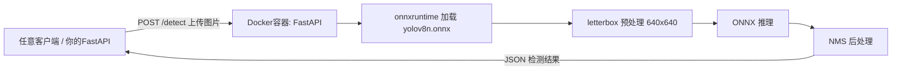

# YOLOv8n ONNX 推理服务（Docker 封装）

把 `yolov8n.onnx` 模型 + 推理环境（onnxruntime + FastAPI）封装成 Docker 镜像，
对外提供 HTTP 接口，任何程序都能调用目标检测能力。

## 目录结构

```
yolo_onnx_service/
├── app/
│   ├── __init__.py
│   ├── yolo_detector.py   # ONNX 推理封装（letterbox 预处理 + NMS 后处理）
│   ├── main.py            # FastAPI 接口 + 托管前端页面
│   └── static/
│       └── index.html     # Web 前端界面（上传图片可视化检测）
├── models/
│   └── yolov8n.onnx       # 模型（从 week13/onnx_models 复制）
├── requirements.txt
├── Dockerfile
├── docker-compose.yml
├── client_test.py         # 本地测试客户端
└── README.md
```

## 快速开始

```bash
# 1. 构建并启动（首次会下载基础镜像和依赖，稍慢）
docker compose up -d --build

# 2. 查看状态 / 日志
docker compose ps
docker compose logs -f

# 3. 测试接口
D:/project/step1/env/python.exe client_test.py ../../week13/img.jpg

# 4. 浏览器打开 Web 前端界面（可视化检测）
http://127.0.0.1:8001/

# 5. 浏览器看 Swagger 接口文档
http://127.0.0.1:8001/docs

# 6. 停止服务
docker compose down
```

## Web 前端界面

浏览器打开 `http://127.0.0.1:8001/` 即可使用：

- 📤 点击或拖拽上传图片
- 🎚️ 拖动"置信度阈值"滑块实时调整检测灵敏度
- 🖼️ 原图与标注图左右对比
- 📋 下方表格列出每个目标的类别、置信度、坐标

前端是纯静态 HTML（`app/static/index.html`），由 FastAPI 直接托管，
不依赖任何前端构建工具，改完重新 `docker compose up -d --build` 即可生效。

## 接口一览

| 方法 | 路径 | 说明 |
|------|------|------|
| GET  | `/health` | 健康检查 |
| GET  | `/docs`   | Swagger 接口文档 |
| POST | `/detect` | 上传图片，返回检测框 JSON（类别/置信度/坐标） |
| POST | `/annotate` | 上传图片，返回画好框的标注图 |

`/detect` 请求示例（multipart 表单，字段名 `file`）：

```bash
curl -X POST http://127.0.0.1:8001/detect \
  -F "file=@../../week13/img.jpg"
```

返回示例：

```json
{
  "filename": "img.jpg",
  "width": 1280,
  "height": 720,
  "num_detections": 2,
  "detections": [
    {"class_id": 0, "class_name": "person", "confidence": 0.92, "bbox": [10, 20, 300, 500]}
  ]
}
```

## 工作原理



## 常用运维命令

```bash
docker compose ps              # 查看容器状态
docker compose logs -f         # 实时日志
docker compose restart         # 重启
docker compose down            # 停止并删除容器
docker image ls                # 查看镜像
```

## 扩展

- **换模型**：把新的 `.onnx` 放进 `models/`，改环境变量 `MODEL_PATH` 后重新构建。
- **GPU 加速**：把 `yolo_detector.py` 里的 provider 换成
  `["CUDAExecutionProvider", "CPUExecutionProvider"]`，并改用带 CUDA 的镜像。
- **在别人的 FastAPI 里调用**：直接 `httpx.post("http://127.0.0.1:8001/detect", files={"file": ...})`
  即可，与 `client_test.py` 相同。
