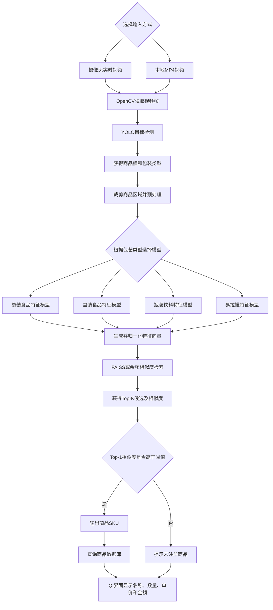

# 智能称重台项目计划书

## 1. 项目基本信息

- 项目名称：基于目标检测与深度特征检索的智能称重台系统
- 项目类型：人工智能视觉识别综合实训项目
- 项目成员：小组协作完成
- 计划识别规模：4种包装类型、24个SKU
- 当前版本范围：以视觉检测、商品识别、商品计数、价格查询和界面展示为主，预留重量传感器接口，重量采集暂不作为本阶段答辩的硬性验收内容。

## 2. 项目背景

传统商品结算需要人工查找商品、确认价格并录入数量，效率较低，也容易出现商品选择错误。智能称重台项目利用摄像头采集商品图像，通过目标检测模型判断商品包装类型，再使用对应的商品特征模型提取深度特征，最后与商品特征向量库进行相似度匹配，从而获得具体SKU、商品名称和价格。

本项目以24个SKU作为答辩演示范围，在保证方案能够落地的前提下，完成从数据采集、模型训练、模型部署到界面展示的完整人工智能工程流程。

## 3. 项目目标

1. 支持摄像头实时视频和本地MP4视频两种输入方式，并可在界面中切换。
2. 使用YOLO目标检测模型定位画面中的商品，并将商品划分为袋装食品、盒装食品、瓶装饮料和易拉罐4种包装类型。
3. 针对4种包装类型分别训练商品特征模型，每个模型负责识别本类型下的6个SKU，共24个SKU。
4. 对检测框中的商品图像进行裁剪、缩放和归一化，提取固定维度的特征向量。
5. 使用余弦相似度或FAISS向量检索完成商品特征匹配，输出Top-K候选商品。
6. 设置相似度阈值：高于阈值时输出具体SKU，低于阈值时提示“未注册商品”。
7. 根据商品ID查询商品名称、单价等信息，并在Qt界面中显示识别结果、数量和金额。
8. 完成模型导出与部署，为后续ONNX、TensorRT和Docker部署保留扩展能力。

## 4. 商品类别规划

系统共设置4种包装类型，每种包装类型包含6个SKU。

| YOLO检测类别 | 专用特征模型 | SKU数量 | 主要识别特征 |
|---|---|---:|---|
| 袋装食品 | 袋装食品特征模型 | 6 | 包装图案、颜色、文字、袋体形状 |
| 盒装食品 | 盒装食品特征模型 | 6 | 盒体颜色、正反面图案、侧面文字 |
| 瓶装饮料 | 瓶装饮料特征模型 | 6 | 瓶型、标签、液体颜色、瓶盖颜色 |
| 易拉罐 | 易拉罐特征模型 | 6 | 罐身图案、品牌文字、颜色布局 |

瓶装饮料组当前选取的6个SKU如下：

| 编号 | 数据集目录 | 商品 |
|---|---|---|
| BOTTLE_01 | BOTTLE_01_greentea | 绿茶 |
| BOTTLE_02 | BOTTLE_02_orange juice | 胖东来橙汁 |
| BOTTLE_03 | BOTTLE_03_yogurt | 瓶装酸奶 |
| BOTTLE_04 | BOTTLE_04_mizone | 脉动 |
| BOTTLE_05 | BOTTLE_05_wahaha | 娃哈哈饮料 |
| BOTTLE_06 | BOTTLE_06_starbucks | 星巴克瓶装咖啡 |

## 5. 系统总体方案

系统采用“包装类型检测 + 类别专用特征提取 + 向量检索”的两阶段识别方案。



### 5.1 商品注册流程

1. 为每个SKU采集多背景、多光照和多角度商品图片。
2. 使用对应包装类型的特征模型提取图片特征。
3. 对特征向量进行L2归一化。
4. 一个SKU保存多个代表性特征，减少角度和光照变化造成的影响。
5. 将特征向量写入向量库，并将SKU、名称和价格写入商品数据库。

### 5.2 实时识别流程

1. 从摄像头或MP4文件中读取视频帧。
2. YOLO模型检测商品位置和包装类型。
3. 根据检测框裁剪商品区域，进行缩放、归一化等预处理。
4. 根据包装类型调用相应的特征模型。
5. 将查询特征与对应类别的商品特征向量库进行相似度比较。
6. 对相似度结果排序并返回Top-K候选。
7. Top-1相似度超过阈值时确认商品，否则判定为未注册商品。
8. 汇总同一SKU的检测数量，查询商品价格并在界面中显示结果。

## 6. 技术选型

| 模块 | 计划采用技术 | 作用 |
|---|---|---|
| 视频输入 | OpenCV | 读取摄像头和MP4视频 |
| 包装检测 | YOLO | 检测商品位置并判断4种包装类型 |
| 特征模型 | ResNet18或ResNet50 | 提取商品深度特征 |
| 度量学习 | ArcFace，可先用Softmax分类作为基线 | 增强不同SKU在特征空间中的区分度 |
| 相似度匹配 | 余弦相似度、FAISS | 搜索最相似的商品特征 |
| 商品数据 | MySQL或SQLite | 保存SKU、名称、价格等信息 |
| 模型训练 | PyTorch | 完成模型训练与验证 |
| 模型部署 | ONNX Runtime，后续可扩展TensorRT | 提高模型的跨平台部署能力 |
| 桌面界面 | Qt/PySide6 | 显示视频、检测框和商品结算信息 |
| 接口服务 | FastAPI，可作为扩展模块 | 提供模型推理接口 |

本项目暂不采用ViT等尚未学习的模型，优先使用能够理解、讲解和部署的CNN方案。

## 7. 数据集制作方案

本项目需要分别制作YOLO目标检测数据集和SKU特征分类数据集，两组数据不能混为一套。

### 7.1 YOLO目标检测数据集

- 标注形式：矩形框标注，不使用关键点标注。
- 检测类别：袋装食品、盒装食品、瓶装饮料、易拉罐，共4类。
- 拍摄内容：一张图片中可以出现多个商品和多个包装类别。
- 场景变化：不同背景、光照、拍摄距离、摆放角度和轻度遮挡。
- 标注要求：检测框尽量贴合商品完整外轮廓，不切掉包装主体。
- 数据平衡：4个检测类别的实例数量应尽量接近。
- 划分原则：按照独立视频或独立拍摄批次划分训练集、验证集和测试集。

### 7.2 SKU特征分类数据集

- 每种包装类型单独建立6个SKU类别。
- 训练图片以单个商品为主，覆盖正面、背面、侧面、横放、竖放和倾斜姿态。
- 每个SKU均应经历相同的一组背景和光照条件，防止模型把背景当成商品特征。
- 袋装食品增加轻微褶皱和形变；盒装食品覆盖不同侧面；瓶装饮料和易拉罐覆盖旋转与横竖摆放。
- 从视频中按每秒1帧抽取图片，人工删除运动模糊、严重遮挡、商品出画和高度重复的图片。
- 建议每个SKU保留100～150张以上有效训练图片。
- 验证集和测试集需要另外拍摄，不能从同一段训练视频的相邻帧中随机划分，避免数据泄漏。

### 7.3 数据增强方案

- 轻微旋转、缩放和平移。
- 随机亮度、对比度和饱和度变化。
- 轻度模糊和噪声，用于模拟摄像头画质变化。
- 随机裁剪时必须保留商品主体和主要标签。
- 原则上不使用水平翻转，避免包装文字和品牌标识反向。

### 7.4 当前数据进度

- 瓶装饮料6个SKU的训练视频已经拍摄完成。
- 每个SKU包含4种背景或光照条件的视频。
- 已使用 `extract_frames.py` 按每秒1帧完成抽帧。
- 已完成人工筛选，当前保留942张瓶装饮料训练图片。
- 已使用 `rename_frames.py` 将图片统一重命名为 `BOTTLE_编号_序号.jpg`。
- 瓶装饮料验证集、测试集以及其他3种包装类别的数据仍需按统一标准完成。

## 8. 模型训练方案

### 8.1 YOLO检测模型

1. 将所有小组成员采集的检测图片合并。
2. 统一4个类别的名称和编号。
3. 检查漏标、错标和过大或过小的检测框。
4. 划分训练集、验证集和测试集。
5. 使用预训练YOLO模型进行迁移学习。
6. 根据Precision、Recall、mAP和混淆矩阵调整数据与参数。
7. 导出ONNX模型并验证推理结果一致性。

### 8.2 商品特征模型

每种包装类型训练一个专用模型，每个模型负责6个SKU。第一阶段可使用预训练ResNet18加分类头获得基线结果；第二阶段再使用ArcFace等度量学习方法优化Embedding空间。

训练步骤如下：

1. 加载ImageNet预训练的ResNet18或ResNet50。
2. 替换输出层，使其适配当前包装类型下的6个SKU。
3. 使用训练集训练，并根据验证集准确率保存最佳权重。
4. 去除或绕过最终分类层，使用中间特征作为Embedding。
5. 对Embedding进行L2归一化，建立商品特征向量库。
6. 使用测试集测试Top-1准确率和Top-K召回率。
7. 使用未注册商品测试相似度阈值，平衡误识别和拒识率。

## 9. 软件模块划分

```text
smart_weighting_platform/
├── camera/                 # 摄像头与MP4输入
├── detector/               # YOLO检测模型与推理代码
├── feature_models/         # 4种包装类型的特征模型
├── retrieval/              # 特征归一化、FAISS与相似度检索
├── database/               # 商品信息和价格数据库
├── ui/                     # Qt界面
├── datasets/               # 数据集配置与处理脚本
├── models/                 # PyTorch和ONNX模型文件
├── tests/                  # 功能测试与模型测试
└── main.py                 # 系统启动入口
```

主要功能模块如下：

1. 输入管理模块：负责摄像头和MP4文件的打开、切换、暂停与关闭。
2. 目标检测模块：输出检测框、包装类型和置信度。
3. 特征提取模块：根据包装类型选择对应模型并生成Embedding。
4. 向量检索模块：完成Top-K搜索、排序和阈值判断。
5. 商品数据库模块：维护SKU、名称、单价和特征索引关系。
6. 结果汇总模块：合并重复检测结果，统计商品数量和金额。
7. Qt界面模块：显示视频画面、检测框、识别结果和商品列表。

## 10. 小组任务分工

| 任务角色 | 主要工作内容 | 交付物 |
|---|---|---|
| 袋装食品负责人 | 采集6个袋装SKU，整理分类数据并训练特征模型 | 袋装数据集、模型权重、测试结果 |
| 盒装食品负责人 | 采集6个盒装SKU，整理分类数据并训练特征模型 | 盒装数据集、模型权重、测试结果 |
| 瓶装饮料负责人 | 采集6个瓶装SKU，整理分类数据并训练特征模型 | 瓶装数据集、模型权重、测试结果 |
| 易拉罐负责人 | 采集6个易拉罐SKU，整理分类数据并训练特征模型 | 易拉罐数据集、模型权重、测试结果 |
| 全体成员 | 共同采集和标注YOLO多商品检测数据 | 4类YOLO检测数据集 |
| 系统集成人员 | 完成模型路由、向量检索、数据库和Qt界面 | 可运行的完整演示程序 |

每位类别负责人应使用统一的数据目录、类别编号、训练参数记录和评估表格，最终由小组统一整合。

## 11. 项目进度安排

| 阶段 | 主要任务 | 阶段成果 |
|---|---|---|
| 第一阶段：需求与选品 | 确定4类包装、24个SKU、技术路线和拍摄标准 | 需求说明、SKU清单、数据规范 |
| 第二阶段：数据制作 | 拍摄分类视频、抽帧筛选、拍摄检测场景并画框 | 两套完整数据集 |
| 第三阶段：模型训练 | 训练YOLO检测模型和4个商品特征模型 | 最佳模型权重、训练曲线、评估结果 |
| 第四阶段：向量库与数据库 | 注册商品特征、设置阈值、录入名称和价格 | 特征向量库、商品数据库 |
| 第五阶段：系统集成 | 接入摄像头和MP4、模型路由、检索与Qt界面 | 可运行的系统程序 |
| 第六阶段：测试优化 | 测试已注册、未注册、遮挡、暗光和多商品场景 | 测试记录、问题清单、优化结果 |
| 第七阶段：答辩准备 | 整理项目文档、演示视频、PPT和答辩讲解 | 答辩材料与最终演示 |

## 12. 测试方案与验收指标

### 12.1 功能测试

- 能正常打开和关闭摄像头。
- 能选择并播放本地MP4文件。
- 视频输入切换后程序不崩溃。
- 能在画面中显示商品检测框和包装类型。
- 能调用正确的包装类型特征模型。
- 能输出Top-K候选商品和相似度。
- 能识别24个已注册SKU。
- 对相似度低于阈值的商品显示“未注册商品”。
- 能显示商品名称、数量、单价和金额。

### 12.2 模型目标指标

以下指标作为答辩版本的目标值，并根据最终硬件和测试环境进行记录：

| 指标 | 目标值 |
|---|---:|
| YOLO四类检测mAP@0.5 | 不低于90% |
| 已注册SKU标准场景Top-1准确率 | 不低于90% |
| 已注册SKU Top-5召回率 | 不低于95% |
| 未注册商品拒识率 | 不低于80% |
| 视频连续推理速度 | 不低于10 FPS，或满足流畅演示要求 |

除总体准确率外，还需保存混淆矩阵，并重点观察相似包装、反光、遮挡和暗光条件下的错误案例。

## 13. 风险分析与解决方案

| 风险 | 可能问题 | 解决方案 |
|---|---|---|
| 背景与SKU绑定 | 模型学习背景而不是商品 | 每个SKU使用相同的背景组合，增加背景多样性 |
| 视频帧高度重复 | 图片数量很多但有效信息少 | 低频抽帧、人工去重、补拍不同角度 |
| 数据泄漏 | 验证准确率虚高 | 按独立视频或独立拍摄批次划分数据集 |
| 运动模糊与遮挡 | 标签特征不清晰 | 删除严重模糊帧，补充轻度困难样本 |
| 透明瓶和反光包装 | 商品边界或标签识别不稳定 | 增加不同光线、角度和深色背景样本 |
| 未注册商品被误识别 | Top-1始终返回已有SKU | 使用相似度阈值并采集未知商品测试集 |
| YOLO类别判断错误 | 调用了错误的特征模型 | 提高检测数据质量，必要时保留多类别候选策略 |
| 模型推理速度不足 | 界面卡顿、视频延迟 | 使用较小模型、降低输入尺寸、ONNX或TensorRT加速 |
| 小组数据格式不统一 | 合并和训练困难 | 统一目录结构、类别编号、命名规则和检查脚本 |

## 14. 预期成果

1. 4类YOLO目标检测数据集及检测模型。
2. 4套SKU特征分类数据集及4个商品特征模型。
3. 包含24个SKU的商品特征向量库。
4. 商品信息与价格数据库。
5. 支持摄像头和MP4双输入的Qt演示程序。
6. 已注册商品识别、Top-K候选显示和未注册商品判断功能。
7. PyTorch模型、ONNX模型和完整推理代码。
8. 数据处理脚本、训练记录、测试报告、项目计划书和答辩PPT。

## 15. 答辩演示流程

1. 展示系统总体架构和两阶段识别思路。
2. 选择MP4文件，演示视频检测和SKU识别流程。
3. 切换摄像头，演示实时推理。
4. 放入24个已注册SKU中的商品，展示正确名称、数量和价格。
5. 放入未参与训练和注册的相似商品，展示“未注册商品”提示。
6. 展示Top-K相似度、检测结果和商品数据库信息。
7. 展示数据集制作、模型训练曲线、混淆矩阵和典型错误案例。
8. 总结当前版本的限制以及重量传感器、更多SKU和TensorRT部署等后续方向。

## 16. 后续扩展方向

- 接入称重传感器，通过串口读取实际重量。
- 对按重量售卖的商品实现“重量 × 单价”自动计价。
- 扩大商品特征库，由24个SKU扩展到更多SKU。
- 增加多目标跟踪，避免视频连续帧重复计数。
- 使用TensorRT进行GPU推理加速。
- 将推理服务封装为FastAPI接口，并通过Docker进行部署。
- 增加商品注册、价格修改和特征库更新界面。

