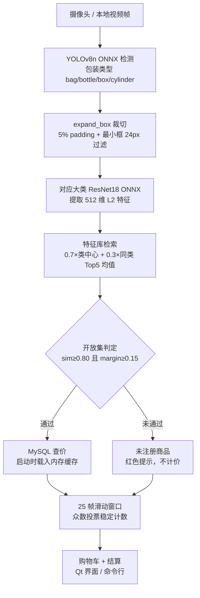

# 智能称重台项目总结

## 1. 项目概述

本项目实现了一套可在 Windows 桌面端运行的智能商品识别与结算系统。系统不是直接让一个模型完成所有工作，而是将任务拆成“包装检测、SKU特征检索、开放集判定、商品数据库、稳定计数、Qt交互”六个部分。

最终答辩版本包含：

- 1个能够检测4种包装类别的 YOLOv8n 模型。
- 4个 ResNet18 SKU 特征提取模型。
- 24个训练 SKU，以及现场无需重训即可在线注册的阿萨姆奶茶 SKU；演示初始态特意保留为24 SKU。
- MySQL 商品信息与价格数据库。
- ONNX Runtime CUDA GPU 推理。
- 摄像头和本地视频端到端识别。
- Qt 商品列表、购物车、金额、结算、暂停、重置和注册界面。
- 未注册商品开放集拦截。

最终在线注册验证中，系统在独立多商品视频里保留原7件商品，并把阿萨姆奶茶识别为新增第8件，购物车总计8件、¥41.60。新拍的竖放/横放阿萨姆视频最终稳定为1件、¥3.00。

## 2. 开发过程

### 2.1 数据准备

项目最初从商品视频和 YOLO 场景视频开始构建数据集：

1. 对 YOLO 视频按固定频率抽帧并人工标注4类包装框。
2. 检查标签格式、坐标范围、图片对应关系和重复框。
3. 对连续近重复帧生成拼图并人工复核，保留遮挡、商品增减和背景变化等有效场景。
4. 用训练好的 YOLO 从24个 SKU 视频中自动定位商品并裁切分类图片。
5. 使用清晰度、目标跟踪、面积比例和感知哈希过滤错误或重复裁剪。
6. 单独拍摄 val 视频，人工删除手部遮挡超过约三分之二等无效样本。

数据集制作阶段比模型训练更耗时间。模型能否在真实摄像头中工作，很大程度取决于裁剪是否准确、训练/验证是否独立、背景是否多样以及是否存在大量连续重复帧。

### 2.2 模型训练

YOLOv8n 负责检测4个包装大类。ResNet18 不直接训练24分类，而是按 bag、bottle、box、cylinder 拆成4个6分类模型，使每个模型只处理相同包装形态下的细粒度商品。

ResNet 使用 ImageNet 预训练、AdamW、标签平滑和早停。训练日志中部分模型在14～20轮提前停止，这是验证集指标连续8轮没有提升后的正常行为，不是训练失败。最终3个大类验证 Top-1 达到100%，cylinder 达到99.59%。

### 2.3 从 Softmax 分类转向特征检索

早期流水线直接使用 Softmax 最大概率作为 SKU 结果。这种方式的核心问题是：即使输入完全没有注册，Softmax 也必须从已有类别中选一个。

真实摄像头测试中出现了典型错误：

- 冰红茶瓶被识别成胖东来橙汁。
- 阿萨姆奶茶曾被识别成星巴克咖啡。
- 复杂桌面背景中的误检测框也会被强行映射到最近商品。

项目随后补上特征向量库：将 ResNet 分类头替换为 Identity，提取512维向量，对每个 SKU 保存多张样本特征和类中心。检索分数结合类中心相似度与同类 Top5 样本均值，再通过 Top1 相似度和 Top1/Top2 间隔共同判断是否为注册商品。

这个改动解决了“模型总要猜一个商品”的根本问题。最终冻结阈值为：

```text
similarity >= 0.80
margin >= 0.15
```

冰红茶和注册前的阿萨姆均能被拒绝，不再错误映射到原有商品；阿萨姆完成在线注册后则使用动态类专用判定进入购物车。

### 2.4 真实场景域适配

星巴克在分类验证集上表现正常，但真实场景中容易受到拍摄距离、背景、反光和裁剪差异影响。项目没有立即重训全部模型，而是补拍真实场景视频，将经过检测和筛选的星巴克特征追加进 bottle 特征库。

扩充后星巴克在真实验证视频中能够稳定识别为 `BOTTLE_06_starbucks`，说明特征库增量扩充可以用于修复“训练图片与实际使用环境不一致”的域差异。

### 2.5 ONNX 部署与 GPU 推理

训练模型最初以 PT 文件运行。为减少运行依赖并提高部署一致性，项目导出了：

- 1个 YOLO 检测 ONNX。
- 4个 ResNet18 特征 ONNX。

ONNX 与 PT 的特征和检测结果经过一致性验证。特征余弦达到1.000000，检测框 IoU 为0.9932，类别一致率100%。运行时自动优先使用 CUDAExecutionProvider，没有可用 CUDA 时回退 CPU。

### 2.6 Qt 桌面端

最终使用 PySide6 制作独立的 `smart_checkout_qt` 工程。推理运行在 QThread 中，避免模型加载和逐帧识别阻塞主界面。

界面包含：

- 摄像头0/1/2与本地视频切换。
- 开始、暂停、继续和停止。
- 实时检测框、商品名、价格、相似度和类别间隔。
- 25帧稳定购物车。
- 未注册商品告警。
- 重置与结算。
- 未注册商品信息录入和特征增量更新入口。

## 3. 遇到的主要困难与解决方案

### 3.1 未注册商品被强制识别成已注册商品

**现象**：冰红茶在“未注册”和胖东来橙汁之间跳动；阿萨姆被识别成星巴克。

**原因**：Softmax 是闭集分类，无法表达“以上都不是”。只使用最高分类概率不能可靠拒绝未知商品。

**解决**：引入多样本特征库，并增加 Top1/Top2 margin。只有相似度和类别间隔同时通过才计价。

**经验**：开放集识别不能只看 Top1；“第一名和第二名是否拉开”往往比绝对相似度更重要。

### 3.2 验证集准确率很高，摄像头效果仍然不稳定

**现象**：ResNet 验证 Top-1 接近100%，但换到房间、桌面和摄像头后会拒识或误识别。

**原因**：验证视频和训练视频的拍摄设备、背景、构图仍然相似，不能完全代表真实使用域。反光、手部、低照度和检测框偏移都会改变特征。

**解决**：补拍真实场景视频扩充特征库，并保留独立未注册样本做阈值标定。

**经验**：高验证准确率不等于真实部署可靠；必须进行摄像头端到端测试。

### 3.3 连续视频抽帧带来大量重复样本

**现象**：在线注册阿萨姆和有糖可乐时虽然加入20张图片，但样本间平均余弦相似度达到0.9998～0.9999，几乎等于重复同一帧。

**原因**：简单保存最近20帧只覆盖不到1秒，数量看起来增加了，实际没有增加姿态、角度和光照信息。

**最终处理**：未知样本改为跨时间缓存；补充视频按固定时间间隔均匀抽帧，再通过清晰度和感知哈希过滤。阿萨姆视频66个采样点全部取得主体，最终筛选52张特征并建立4个姿态原型。

**验证结果**：注册完成后立即热重载并清空旧稳定窗口。新视频选取的32张测试裁剪全部以阿萨姆为 Top-1 并通过动态类门限；独立多商品视频最终为8件、¥41.60。

### 3.4 外观高度相似的细粒度 SKU 难以区分

**现象**：有糖和无糖可口可乐罐形、红色罐身和图案几乎一致，仅文字颜色和“无糖”标识不同。

**原因**：普通交叉熵训练只保证原训练类别可被分类头分开，没有显式约束512维余弦空间的类间距离。局部文字差异还会被224×224缩放和全局平均池化削弱。

**未来改进**：将这类商品作为困难负样本，使用 ArcFace、SupCon 或 Triplet Loss；提高输入分辨率；加入局部标签/OCR或条码识别。

### 3.5 横放商品直接漏检

**现象**：有糖可乐竖放时 YOLO 可以稳定检测，横放区间大量帧没有检测框。

**原因**：YOLO 训练数据中的罐装商品以竖放为主。分类特征再丰富，如果检测阶段没有框，后续检索仍然无法执行。

**当前处理**：原图无检测时增加重叠方形分块和90度旋转后备检测，并将检测框映射回原图；常规有框场景不增加额外推理。长期仍应把横放商品正式加入 YOLO 训练集。

### 3.6 复杂背景产生“虚空画框”

**现象**：灰色布料、床单、桌面纹理被 YOLO 当成袋装或盒装商品，其中某些假框甚至刚好通过特征阈值进入购物车。

**原因**：检测训练集中空背景和困难负样本不足；稳定窗口对静止背景假阳性反而会持续确认。

**临时措施**：答辩使用干净背景和已验证视频，不随意降低检测或特征阈值。

**未来改进**：加入空桌面、布料、鼠标垫等无目标图片和 hard negative，重新训练 YOLO，并结合检测置信度、持续轨迹和区域约束。

### 3.7 Pillow 画框坐标越界

**现象**：Qt 运行时反复弹出 `y1 must be greater than or equal to y0`。

**原因**：YOLO 框靠近图像顶部时可能返回负坐标，标签背景矩形的上、下坐标顺序因此反转。

**解决**：检测结果入队前按实际帧尺寸裁剪；绘图函数再次防御性裁剪；顶部空间不足时将标签放入框内；增加四方向越界回归测试。

**经验**：模型输出不能直接交给绘图库，所有坐标都应先裁剪、排序和验证。

### 3.8 ONNX YOLO 坐标解码错误风险

**问题**：不同导出方式的 YOLO ONNX 输出可能是像素坐标，也可能是归一化坐标。如果误认为归一化坐标再次乘以640，框会完全错误。

**解决**：通过 PT/ONNX 框 IoU 对比确认当前输出是640输入空间的像素坐标，解码时只进行 letterbox 逆变换。

**经验**：ONNX 输出张量形状相同不代表语义相同，必须做数值级一致性验证。

### 3.9 ONNX Runtime 没有启用 GPU

**现象**：安装了 GPU 版 ONNX Runtime，但 Provider 仍可能只显示 CPU。

**原因**：Windows 进程没有找到 PyTorch 环境中随附的 CUDA/cuDNN DLL。

**解决**：`onnx_engine.py` 在创建会话前将 `torch/lib` 注入 DLL 搜索路径，并明确请求 CUDA 和 CPU Provider。

**经验**：安装 GPU 包不等于真正启用了 GPU，必须检查 `session.get_providers()` 并测量实际速度。

### 3.10 Qt Creator 调试按钮为灰色

**原因**：新建 Qt for Python 项目后没有关联可用的 Python Kit，项目显示“未配置”。

**解决**：在 Qt Creator 中注册 `D:\project\step1\env\python.exe`，生成 Python 3.11 Kit 并应用到项目。

### 3.11 两套 Qt 工程容易混淆

**现象**：工作区同时存在 `smart_checkout_ui` 和 `smart_checkout_qt`。

**处理**：明确 `smart_checkout_qt` 为最终答辩版；`smart_checkout_ui` 仅保留作历史对照，不在两套代码之间交叉复制界面实现。

### 3.12 数据库与特征库必须一致更新

**问题**：新增或删除 SKU 同时涉及 MySQL、embeddings、labels、centers、classes 和 metadata。只改其中一处会造成类别索引错位或商品查价失败。

**解决**：注册统一通过 `feature_library_updater.py`；写入失败会恢复特征文件并删除不完整数据库记录。阿萨姆注册后 bottle 特征库为7类，MySQL共有25条有效商品。为完整展示“未注册→现场注册→立即识别”的过程，工程交付状态使用 `prepare_registration_demo.py --reset` 恢复为24条商品和6类 bottle 基线；每次演示注册后再变为25条和7类。

**经验**：特征文件和关系数据库虽然是两套存储，但业务上属于同一事务，正式版本应增加更完整的事务、版本号和回滚机制。

### 3.13 Windows 中文路径与编码

**问题**：控制台 GBK 可能无法输出 `¥` 等字符，部分 OpenCV 文件接口对中文路径也不稳定。

**处理**：控制台显式使用 UTF-8；必要时通过 `np.fromfile + cv2.imdecode` 读取、`cv2.imencode + write_bytes` 保存；项目内部统一使用 `pathlib.Path`。

## 4. 本项目形成的关键经验

1. **先保证检测正确，再讨论分类。** 没有正确检测框，分类模型无能为力。
2. **闭集分类不能直接解决未注册商品。** 必须增加开放集拒识策略。
3. **阈值要用注册和未注册样本共同标定。** 只看验证集会过于乐观。
4. **连续帧数量不等于数据多样性。** 去重和姿态覆盖比单纯增加张数更重要。
5. **真实摄像头测试是必需的。** 背景、反光、遮挡和域差异会暴露离线指标看不到的问题。
6. **模型、预处理和特征库是一个整体。** 重训模型后必须重建特征库，导出 ONNX 后必须验证一致性。
7. **误拒绝通常比误计价安全。** 智能结算场景中，保守开放集阈值是合理设计。
8. **界面线程与推理线程必须分离。** 否则模型加载和逐帧推理会卡死 Qt 界面。
9. **所有模型坐标都要防御性处理。** 边界框越界是正常情况，不应导致整条流水线崩溃。
10. **每次重大改动都要保留回归证据。** 视频、CSV、JSON、阈值和冻结文档共同构成可复现结果。

## 5. 答辩要求对应情况

| 要求      | 项目证据                          |
| ------- | ----------------------------- |
| 正确识别商品  | 24个训练 SKU + 1个在线注册 SKU、4个 ResNet18、最终验证视频 |
| 正确计数    | 25帧稳定组合、注册前7件 ¥38.60、注册后8件 ¥41.60 |
| 模型训练    | YOLO 数据划分与训练、4个 ResNet 分组训练   |
| 特征提取模型  | 4个512维 ResNet18 ONNX 与特征库     |
| 注册界面    | Qt 未注册商品录入弹窗和增量更新后端           |
| 识别/结算界面 | 最终 `smart_checkout_qt` 主窗口    |
| Qt      | PySide6 + Qt Creator 工程       |
| 关系数据库   | MySQL `products` 表和 DAO       |
| 缓存减少读取  | 特征库和商品目录启动时载入内存，逐帧不重复读取文件     |
| 速度优化    | ONNX Runtime CUDA GPU，CPU自动回退 |

答辩录制采用同一验证视频前后对照：初始24-SKU状态下阿萨姆被拒绝，最终7件、¥38.60；切换到 `video/asm milktea.mp4` 完成瓶装商品注册后，热重载特征库并再次播放验证视频，最终8件、¥41.60。录制失败时可用 `prepare_registration_demo.py --reset` 恢复初始状态重拍。

当前没有使用 FAISS、ArcFace 或 Web 端，答辩时不应把它们描述成已完成项。

## 6. 未来改进方向

### 6.1 模型与特征

- 使用 ArcFace、SupCon 或 Triplet Loss 训练更适合余弦检索的特征空间。
- 引入困难负样本对，如有糖/无糖可乐、相似饼干包装。
- 使用多原型中心表达同一 SKU 的正面、侧面、横放和竖放姿态。
- 提高细粒度商品输入分辨率，或增加局部标签区域分支。
- 当 SKU 规模扩大后引入 FAISS，并保留 MySQL 存业务信息。

### 6.2 数据

- 在线注册进一步加入目标跟踪，使同一画面中的多个未知商品能够分别采集和注册。
- 增加横放、遮挡、手持、反光、暗光和复杂背景训练样本。
- YOLO 增加空背景和 hard negative，减少虚空画框。
- 建立严格独立的跨设备、跨背景测试集。

### 6.3 工程

- 将 MySQL 连接信息和阈值迁移到环境变量或配置文件。
- 对数据库和特征文件更新增加事务、临时文件、版本号和自动回滚。
- 增加自动化回归：检测指标、开放集 FAR/FRR、购物车结果和 UI 冒烟测试。
- 增加条码或 OCR 作为近似包装商品的兜底识别渠道。
- 如需额外展示，可开发只读 Web 看板，但不影响当前 Qt 答辩主线。

## 7. 最终结论

项目已经完成从数据采集、模型训练、特征库构建、阈值标定、数据库接入、ONNX GPU 部署、Qt 桌面界面到新商品在线注册后立即识别的完整工程闭环。

最重要的改进不是单纯提高闭集验证准确率，而是先解决未注册商品会被强行映射到已有 SKU 的风险，再在不降低原24类全局阈值的前提下，为在线注册类增加高相似度门限、多姿态原型和热重载。当前系统能够完成稳定检测、识别、计数、结算，并支持阿萨姆奶茶注册后立即识别；更大规模商品库和高度近似包装仍作为后续研究方向。

## 8. 系统数据流与模块总览

### 8.1 端到端数据流



### 8.2 单帧推理内部流程

1. YOLO 检测：每个检测框输出类别、置信度、坐标（cls, conf, xyxy）。
2. 过滤：宽高小于 24px 的框丢弃。
3. `expand_box` 按 5% padding 扩展裁切，限制在画面内。
4. 按包装类型选择对应大类的特征库，执行 `retrieval_match_onnx`：
   `score(类) = 0.7 × cos(查询, 类中心) + 0.3 × mean(top5 cos(查询, 类样本))`，
   返回 top1 / top2 / margin。
5. 开放集判定：sim < 0.80 或 margin < 0.15 → 未注册（红色提示、不计价）。
6. 已注册：查商品名称与价格（Qt 版走启动时载入的内存商品目录）。
7. `frame_counts[model_class] += 1`：单帧计数，只累计已注册商品。

### 8.3 模块总览（按流水线阶段）

| 阶段 | 模块 | 作用 |
|---|---|---|
| 数据准备 | `extract_yolo_frames.py` / `append_yolo_frames.py` | YOLO 视频抽帧，增量避免重复 |
| 数据准备 | `rename_yolo_images.py` / `check_yolo_labels.py` | 图片标签改名、格式与坐标质检 |
| 数据准备 | `extract_frames.py` / `rename_frames.py` | SKU 视频抽图、连续短文件名 |
| 数据准备 | `crop_classification_dataset.py` / `build_classification_dataset_from_videos.py` | YOLO 框裁切分类图、全自动建分类数据集 |
| 模型训练 | `train_yolov8.py` / `run_train_yolov8.bat` | 4 类 YOLOv8n 检测训练 |
| 模型训练 | `train_resnet_classifier.py` | 4 个 ResNet18（每大类 6 分类）特征模型训练 |
| 特征库 | `build_feature_library.py` | 提取 512 维特征，构建 embeddings/labels/centers/classes |
| 特征库 | `augment_feature_library.py` | 补充真实场景视频追加样本（星巴克域适配） |
| 特征库 | `calibrate_threshold.py` | 用已注册/未注册样本标定 sim、margin 阈值 |
| 特征库 | `feature_library_updater.py` | 在线注册后端：数据库 + 特征库增量 + 热重载 |
| ONNX | `export_onnx.py` | 导出 1 个 YOLO + 4 个特征 ONNX |
| ONNX | `onnx_engine.py` | 推理核心：YOLO 解码/NMS、特征预处理、向量检索、CUDA 自动启用 |
| ONNX | `verify_onnx.py` | PT/ONNX 一致性验证（特征余弦、框 IoU、类别一致率） |
| 推理 | `pipeline_demo.py` | 命令行端到端：视频/摄像头、检索判定、结算落盘 |
| 推理 | `infer_video.py` | 早期纯 YOLO 检测推理（无检索） |
| 数据库 | `database/mysql_db.py` | PyMySQL 轻量封装，支持环境变量连接 |
| 数据库 | `database/goods_dao.py` | products 表 DAO：查价、注册、更新、结算汇总 |
| 数据库 | `register_goods.py` | 商品命令行管理工具 |
| Qt 界面 | `smart_checkout_qt/` | 最终答辩版：主窗口、推理线程、注册弹窗 |
| Qt 界面 | `smart_checkout_ui/` | 历史对照实现，保留参考 |

### 8.4 一句话总结

整个流水线是**数据 → 训练 → 特征库 → ONNX 部署 → 检索识别 → 数据库 → Qt 界面**七段式：YOLO 负责"是什么包装"，ResNet 特征检索负责"是哪款商品"，双阈值开放集判定负责"认不认识"，25 帧滑动窗口负责"数得准"，MySQL 负责"算得清"。
