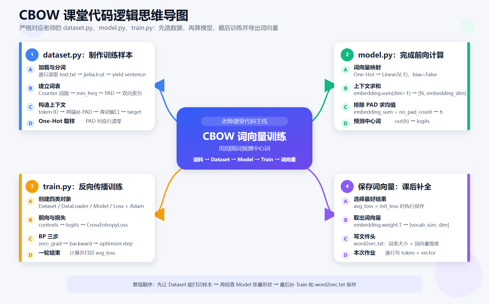

# CBOW 教学版与工程版代码对比

本目录提供了两套实现：

| 层次 | 教学版 | 工程版 |
|---|---|---|
| 数据集 | [`dataset.py`](./dataset.py) | [`dataset_prod.py`](./dataset_prod.py) |
| 模型 | [`model.py`](./model.py) | [`model_prod.py`](./model_prod.py) |
| 训练 | [`train.py`](./train.py) | [`train_prod.py`](./train_prod.py) |

两套代码解决的是同一个问题：根据一个词周围的上下文预测中心词，并在训练过程中得到词向量。

区别不在于“谁对谁错”，而在于目标不同：

- 教学版把数学计算显式展开，方便观察每一步。
- 工程版减少中间数据、内存占用和大词表计算，并补充可恢复、可复现的训练流程。

---

## 作业：老师课堂代码逻辑思维导图

这张图严格按照老师上课敲的三份源码梳理，主线是“制作样本 → 前向计算 → 反向传播 → 补全词向量保存”。



读图时只抓住四件事：

1. `dataset.py` 把文本变成“上下文 One-Hot + 中心词编号”。
2. `model.py` 把上下文变成词向量，排除 PAD 后求均值，再预测中心词。
3. `train.py` 完成前向、损失、清梯度、反向传播和参数更新。
4. 当平均损失刷新最优值时，取出 `embedding.weight.T`，补全 `word2vec.txt` 的逐词写入。

---

## 1. 两套代码的完整流程

### 1.1 教学版

```text
sentence.txt
    ↓
逐行读取与 jieba 分词
    ↓
Counter 统计词频
    ↓
建立 <PAD>、<UNK> 和词表映射
    ↓
把全部 context/target 保存到列表
    ↓
token ID 转成 One-Hot
    ↓
Linear 模拟词向量查询
    ↓
Masked Mean
    ↓
Linear 输出整个词表的 logits
    ↓
CrossEntropyLoss
```

### 1.2 工程版

```text
sentence.txt
    ↓
建立或读取 vocab.json
    ↓
IterableDataset 按行生成 token ID 样本
    ↓
有界缓冲区打乱
    ↓
nn.Embedding 查询上下文词向量
    ↓
Masked Mean
    ↓
正中心词打分 + 少量负样本打分
    ↓
Negative Sampling Loss
    ↓
latest.pt / best.pt / word2vec.txt
```

---

## 2. Dataset 对比

### 2.1 两套代码共同完成的工作

两套 Dataset 都会：

1. 读取 UTF-8 文本，每行作为一个句子。
2. 使用 `jieba` 对中文进行分词。
3. 使用 `Counter` 统计词频。
4. 用 `min_freq` 过滤低频词。
5. 把低频词和词表外词映射成 `<UNK>`。
6. 在句子两端加入 `<PAD>`。
7. 使用滑动窗口生成“上下文 → 中心词”样本。
8. 不让 `<UNK>` 作为中心词标签，避免模型大量学习“预测未知词”。

假设：

```text
窗口大小 = 2
中心词 = 是
```

那么训练样本类似：

```text
上下文：[自然语言, 处理, 人工智能, 的]
中心词：是
```

### 2.2 教学版为什么生成 One-Hot

教学版的 `__getitem__()` 返回：

```text
context_one_hot: [context_size, vocab_size]
target:          一个中心词编号
```

假设词表大小为 5，词编号 2 的 One-Hot 是：

```text
[0, 0, 1, 0, 0]
```

这种表示便于观察“词编号如何进入矩阵计算”，但词表越大，浪费越明显。

假设：

```text
batch_size = 512
context_size = 4
vocab_size = 100000
```

仅一个 batch 的 One-Hot 就包含：

```text
512 × 4 × 100000 = 204800000 个浮点数
```

使用 float32 时大约需要 781 MiB，还没有计算模型中间结果和梯度。

### 2.3 工程版为什么只返回 token ID

工程版返回：

```text
context_ids: [context_size]
target:      一个中心词编号
```

例如：

```text
context_ids = [0, 0, 18, 25]
target = 7
```

同一个 batch 只需要保存：

```text
512 × 4 = 2048 个整数
```

模型通过 `nn.Embedding` 根据编号直接查询词向量，不需要构造长度为整个词表大小的 One-Hot。

### 2.4 预生成样本与流式样本

教学版在初始化时执行：

```python
self.contexts.append(context)
self.targets.append(target)
```

优点：

- 逻辑直接，容易调试。
- 可以实现 `__len__()` 和随机下标访问。
- 小语料训练方便。

缺点：

- 所有样本都留在内存中。
- 原始语料很大时，样本数量可能是原始词数的同一量级。
- 数据集初始化时间长，开始训练前需要等待全部样本生成。

工程版继承 `IterableDataset`，在训练循环真正取数据时才生成样本：

```text
读取一行 → 分词 → 生成当前行样本 → 交给模型
```

它不会把全部上下文长期保存在内存中。

### 2.5 工程版如何打乱流式数据

普通 `Dataset` 可以使用：

```python
DataLoader(dataset, shuffle=True)
```

但流式 `IterableDataset` 不知道完整样本总量，也不能直接随机访问所有样本。因此工程版使用固定大小的随机缓冲区：

```text
不断读取新样本
    ↓
放入有限大小的 buffer
    ↓
从 buffer 中随机选择样本输出
```

这不是数学上的完全随机排列，但内存占用固定，适合大语料。

打乱的随机顺序由 `seed + epoch` 共同决定，因此**每一轮顺序不同、但同一轮可以复现**。工程版训练循环里每轮开头调用 `dataset.set_epoch(epoch)`，就是让缓冲区的伪随机种子随轮数变化。

### 2.6 多进程读取

工程版通过 `get_worker_info()` 获得当前 DataLoader worker 编号，并按照行号分工，避免多个 worker 生成相同训练样本。

```text
worker 0：第 0、2、4……行
worker 1：第 1、3、5……行
```

当前实现优先保证逻辑正确。每个 worker 仍然需要扫描整个文本文件并跳过不属于自己的行；真正达到超大语料规模时，应当提前把语料切成多个物理分片，让不同 worker 分别读取不同文件。

### 2.7 词表前两个固定位置：`<PAD>=0`、`<UNK>=1`

两套代码的词表结构都是：

```text
索引 0：<PAD>    索引 1：<UNK>    索引 2 起：真实词
```

这个约定会**连锁影响数据、模型、导出三处**，读代码时值得放在一起理解：

1. PAD 的 One-Hot 天然落在第 0 位为 1，所以教学版在 `__getitem__` 里要把 PAD 行整体清零；
2. PAD 编号 0 又传给工程版 `nn.Embedding(..., padding_idx=0)`，保证 PAD 词向量恒为零向量；
3. 中心词只从真实词中选取，目标编号不可能是 0，因此 `CrossEntropyLoss` 不需要 `ignore_index`（见 4.2）；
4. 导出 `word2vec.txt` 时跳过索引 0——全零的 PAD 向量没有语义，不该写进结果。

另外，`Vocabulary.build` 会把**所有被 `min_freq` 过滤掉的词的频次加总，记为 `<UNK>` 的 counts**。这个数字只服务于负采样，让“哪些词更常被当成负样本”的分布仍然贴近真实语料，而不是凭空猜测。

---

## 3. Model 对比

### 3.1 One-Hot + Linear 与 Embedding 的关系

教学版使用：

```python
self.embedding = nn.Linear(
    vocab_size,
    embedding_dim,
    bias=False,
)
```

输入是词编号 `i` 的 One-Hot：

$$
e_i=\operatorname{OneHot}(i)W
$$

由于 One-Hot 只有第 `i` 个位置为 1，这个矩阵乘法实际上只是从权重矩阵中选择第 `i` 个词向量。

工程版直接使用：

```python
nn.Embedding(vocab_size, embedding_dim)
```

即：

$$
e_i=E[i]
$$

二者表达的含义相同，但 `nn.Embedding` 不创建巨大 One-Hot，也不执行大量无意义的零乘法。

还有一个导出时容易踩的小坑：`nn.Linear` 的权重形状是 `[embedding_dim, vocab_size]`，而词向量矩阵应当按行存放每个词，即 `[vocab_size, embedding_dim]`，所以取词向量时必须转置：

```python
# 教学版
token_embeddings = model.embedding.weight.T
```

工程版 `nn.Embedding` 的权重天生就是 `[vocab_size, embedding_dim]`，无需转置。两套代码都通过 `get_token_embeddings()` 统一了这一差异，因此导出的 `word2vec.txt` 行序一致。

### 3.2 为什么教学版的 Linear 必须关闭 bias

教学版会把 PAD 的 One-Hot 整行清零。如果 Linear 带偏置：

$$
0W+b=b
$$

全零的 PAD 输入仍会得到非零向量。因此教学版使用：

```python
bias=False
```

工程版则使用：

```python
nn.Embedding(..., padding_idx=pad_index)
```

保证 PAD 对应的输入词向量维持为零。

### 3.3 两套代码都必须使用 Masked Mean

设上下文是：

```text
[PAD, PAD, 词A, 词B]
```

错误平均值是：

$$
\frac{0+0+e_A+e_B}{4}
$$

正确平均值是：

$$
\frac{e_A+e_B}{2}
$$

因此 PAD 不但不能进入求和的分子，也不能进入平均值的分母：

$$
h=\frac{\sum_j m_j e_j}{\max(1,\sum_jm_j)}
$$

其中：

```text
mj = 1：当前位置是真实词
mj = 0：当前位置是 PAD
```

### 3.4 全词表 Softmax 与负采样

教学版把上下文向量映射成整个词表的预测分数：

```python
logits = self.out(context_mean)
```

输出形状：

```text
[batch_size, vocab_size]
```

然后使用 `CrossEntropyLoss`。这种方式概念清晰，但每个样本都要为词表中的每个词计算分数。

如果词表有 100000 个词，即使当前只关心一个正确中心词，也需要计算 100000 个输出。

工程版采用负采样，每次只计算：

- 1 个正确中心词。
- `num_negative` 个错误中心词。

损失可以写成：

$$
L=-\log\sigma(h^Tv_y)-\sum_{n=1}^{K}\log\sigma(-h^Tv_n)
$$

其中：

- `h` 是上下文平均向量。
- `vy` 是正确中心词的输出向量。
- `vn` 是负样本词向量。
- `K` 是负样本数量。

工程版默认 `K=5`，输出计算从“整个词表”缩小成“1 个正样本 + 5 个负样本”。

负样本不是完全均匀选择，而是按照词频的 0.75 次方采样：

$$
P(w)\propto count(w)^{0.75}
$$

这样既保留高频词更容易被采到的特点，又不会让少数高频词完全支配训练。

具体实现上还有两个容易被忽略的细节：

- `<PAD>`、`<UNK>` 的采样权重被显式置为 0，特殊 token **永远不会被当成负样本**；
- 采样后若某个负样本恰好等于当前正样本（中心词），会**循环重采样替换**，避免把“正确答案”误当成“错误答案”来训练。

### 3.5 为什么工程版有两套 Embedding

工程版包含：

```python
input_embeddings
output_embeddings
```

- `input_embeddings`：上下文词进入模型时使用。
- `output_embeddings`：判断某个词是否是中心词时使用。

这是 Word2Vec 负采样的常见结构。最终导出用于相似度计算的通常是 `input_embeddings`。

工程版对两张表做了不同的初始化，因为它们的“起步状态”要求不同：

- `input_embeddings` 用小范围均匀分布 `uniform(-0.5/dim, 0.5/dim)` 初始化，避免一开始就随机得太大；
- `output_embeddings` 直接**全零初始化**。

全零初始化的原因：起步时正样本得分约为 0，`logsigmoid(0) = -ln 2 ≈ -0.693`，负采样损失一开始就处在一个稳定量级，不会因为随机初始值过大而在前几步震荡失衡；随后 `output_embeddings` 再逐步“长出”有意义的向量。

---

## 4. Train 对比

### 4.1 损失函数不同

教学版：

```python
loss_fn = nn.CrossEntropyLoss()
loss = loss_fn(logits, targets)
```

工程版：

```python
loss = model(context_ids, target_ids, negative_ids)
```

工程版的模型内部直接计算负采样损失。因此两套代码输出的 loss 数值不在同一个尺度上，不能根据绝对大小直接判断哪一套模型更好。

### 4.2 `ignore_index=0` 不能排除上下文 PAD

`CrossEntropyLoss(ignore_index=0)` 只会忽略“中心词标签等于 0”的样本，不会自动忽略输入上下文里的 PAD。

当前 Dataset 从真实词中选择中心词，中心词本身不会是 PAD，所以教学版直接使用：

```python
nn.CrossEntropyLoss()
```

上下文 PAD 由模型内部的 Masked Mean 处理。

### 4.3 可复现训练

工程版固定随机种子：

```python
random.seed(seed)
torch.manual_seed(seed)
torch.cuda.manual_seed_all(seed)
```

固定种子不能保证所有硬件环境中的每一个浮点结果绝对一致，但能显著提高同一环境重复实验的可复现性。

### 4.4 检查点与恢复训练

工程版保存：

```text
artifacts/
├── vocab.json
├── latest.pt
├── best.pt
└── word2vec.txt
```

- `vocab.json`：固定 token 和 ID 的关系。
- `latest.pt`：最近一轮模型和优化器状态，用于恢复训练。
- `best.pt`：目前损失最低的模型。
- `word2vec.txt`：便于其他工具读取的文本词向量。

继续训练时使用：

```powershell
D:\project\step3\llm\python.exe .\train_prod.py --resume
```

如果语料或词频条件改变，需要重新建立词表：

```powershell
D:\project\step3\llm\python.exe .\train_prod.py --rebuild-vocab
```

### 4.5 原子保存

工程版不会直接覆盖检查点，而是：

```text
先写入临时文件
    ↓
写入成功后替换正式文件
```

这样可以降低程序在保存中途退出，导致正式检查点只写了一半的风险。

### 4.6 梯度裁剪

工程版执行：

```python
clip_grad_norm_(model.parameters(), max_norm=5.0)
```

当某一批数据导致梯度突然变大时，梯度裁剪可以降低训练数值不稳定的风险。它不是所有 CBOW 训练都必须使用，但属于成本较低的保护措施。

---

## 5. 运行方式

首先进入当前目录：

```powershell
Set-Location "D:\project\step3\week17"
```

### 5.1 运行教学版

```powershell
D:\project\step3\llm\python.exe .\train.py
```

教学版默认直接读取同目录下的 `sentence.txt`。

### 5.2 运行工程版

```powershell
D:\project\step3\llm\python.exe .\train_prod.py
```

针对较大语料可以调整：

```powershell
D:\project\step3\llm\python.exe .\train_prod.py `
  --corpus .\sentence.txt `
  --min-freq 5 `
  --max-vocab-size 100000 `
  --embedding-dim 128 `
  --batch-size 512 `
  --num-negative 10 `
  --num-workers 2 `
  --epochs 100 `
  --rebuild-vocab
```

当前 `sentence.txt` 只有 20 句话，演示时应使用 `min_freq=1`；如果设成 5，大量词会变成 `<UNK>`，有效中心词会明显减少。

### 5.3 训练产物与效果验证

两套代码都会在运行目录产出可复用文件：

教学版：

```text
cbow_best.pt    # state_dict + word2index/index2word + embedding_dim/window_size/best_loss
word2vec.txt    # 文本格式词向量
```

工程版（输出到 `artifacts/`）：

```text
vocab.json     # token↔编号与频次，保证推理/续训用同一份词表
latest.pt      # 每轮最新的模型 + 优化器，供 --resume 续训
best.pt        # 损失最低的模型
word2vec.txt   # 文本格式词向量
```

`word2vec.txt` 是标准 Word2Vec 文本格式：第一行是“词数 维度”，之后每行是“词 + 空格分隔的向量”（已跳过 `<PAD>`）。不依赖 gensim 也能手工读取并验证相似度：

```python
from pathlib import Path

lines = Path("word2vec.txt").read_text(encoding="utf-8").splitlines()
vectors = {}
for line in lines[1:]:
    parts = line.split()
    vectors[parts[0]] = [float(x) for x in parts[1:]]

def cosine(a, b):
    va, vb = vectors[a], vectors[b]
    dot = sum(x * y for x, y in zip(va, vb))
    return dot / (sum(x * x for x in va) ** 0.5 * sum(y * y for y in vb) ** 0.5)

print(cosine("模型", "训练"))   # 越接近 1 表示语义越相近
```

安装了 gensim 的话也可以直接：

```python
from gensim.models import KeyedVectors
kv = KeyedVectors.load_word2vec_format("word2vec.txt", encoding="utf-8")
print(kv.similarity("模型", "训练"))
```

教学版的检查点加载：

```python
import torch
ckpt = torch.load("cbow_best.pt", map_location="cpu")
```

最后补一句“预期管理”：当前 `sentence.txt` 只有 20 句话，每个词平均只出现 1~2 次，训练得到的词向量**只能用来验证流程是否跑通，不能指望相似度有语义**。想看到“相似词聚在一起”，需要换成成规模的语料并配合更多训练轮数；同时两套 loss 数值不可直接比较（教学版是整表 Softmax 交叉熵，工程版是负采样损失，见 4.1）。

---

## 6. 应该选择哪一套

### 适合使用教学版的情况

- 第一次学习 CBOW 和 Word2Vec。
- 需要观察 One-Hot、矩阵乘法和词向量的关系。
- 数据只有几十句或几千句。
- 重点是理解代码，而不是训练效率。
- 需要配合课堂逐行调试。

### 适合使用工程版的情况

- 语料无法一次性完整装入内存。
- 词表达到几万甚至更多。
- 需要多轮训练、恢复训练和保存最优模型。
- 希望固定词表和配置，保证推理阶段 ID 不发生变化。
- 不需要显式观察 One-Hot。
- 全词表 Softmax 已成为主要计算瓶颈。

---

## 7. 工程版目前的边界

这套工程版是“能够体现真实项目原则的教学骨架”，不是亿级数据平台的最终形态。

当数据进一步扩大时，还应考虑：

1. 提前分词，避免每个 epoch 重复运行 `jieba`。
2. 把语料切成多个物理分片，避免每个 worker 扫描同一个大文件。
3. 将词表统计改成分片统计与归并；当前 `Counter` 的内存仍与不同 token 的数量相关。
4. 使用内存映射、Parquet、WebDataset 等适合顺序读取的存储方式。
5. 增加验证集、训练指标、耗时、吞吐量和异常监控。
6. 在多 GPU 环境下加入分布式训练与全局随机种子管理。
7. 为词表版本、语料版本、代码版本和模型检查点建立对应关系。

---

## 8. 一句话总结

教学版是在回答：

> CBOW 的每一步数学计算究竟是怎么发生的？

工程版是在回答：

> 已经理解原理以后，怎样减少无效计算和内存占用，并让训练能够持续、恢复和复现？

最核心的变化是：

```text
One-Hot + Linear + 全词表 Softmax
                ↓
token ID + Embedding + Negative Sampling
```
